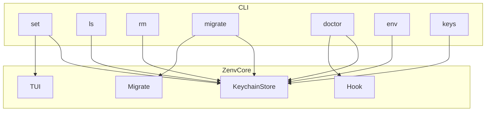

# Architecture

zenv is a Swift CLI. It stores secrets in the macOS login Keychain and loads them in interactive Zsh through `~/.zshrc`.

## Data flow

`zenv set` writes `kSecClassGenericPassword` with service `me.hcuong.zenv`. `zenv doctor` appends a hook that runs `eval "$(command zenv env)"` and builds `_ZENV_KEYS` from `zenv keys`. New interactive shells get the variables. `zsh -c` does not.

## Files

| Path | Role |
|------|------|
| Keychain | Secret values |
| `~/.zshrc` | Loader and masker |
| `~/.zenv/backups/` | Hook and migrate backups |
