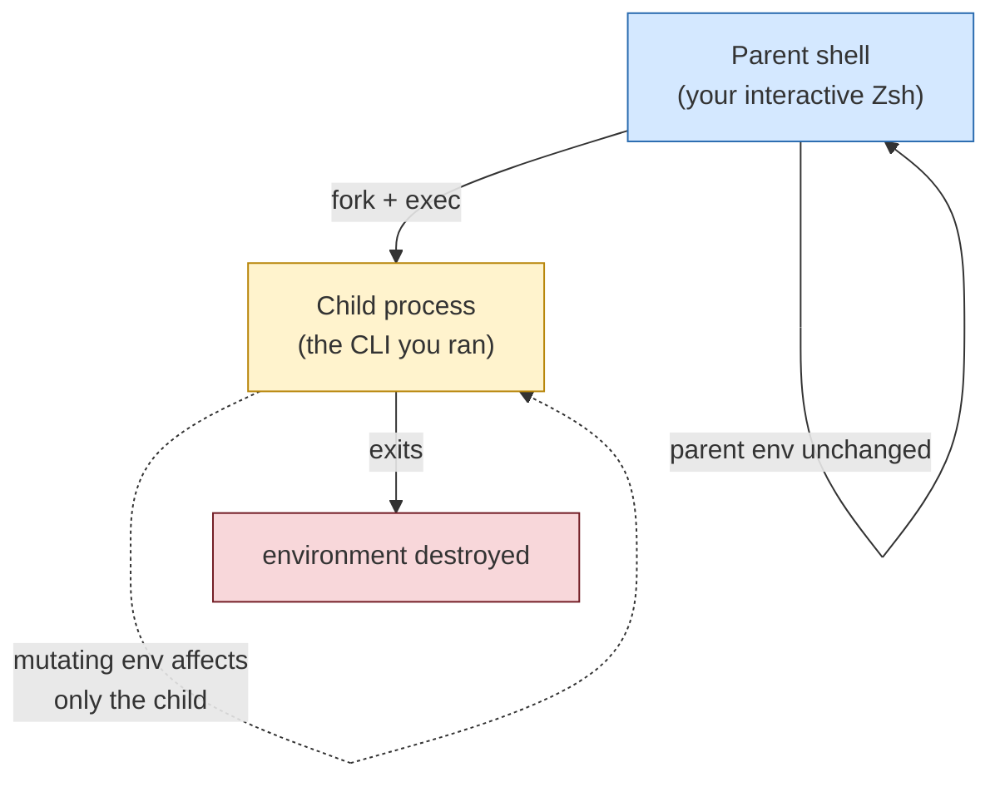
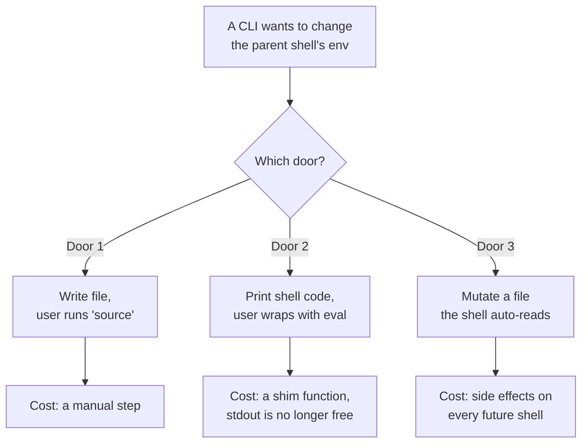
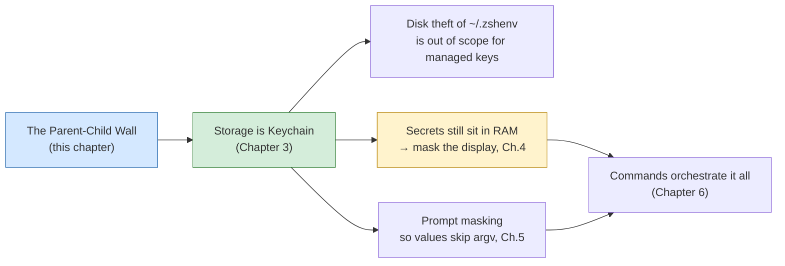
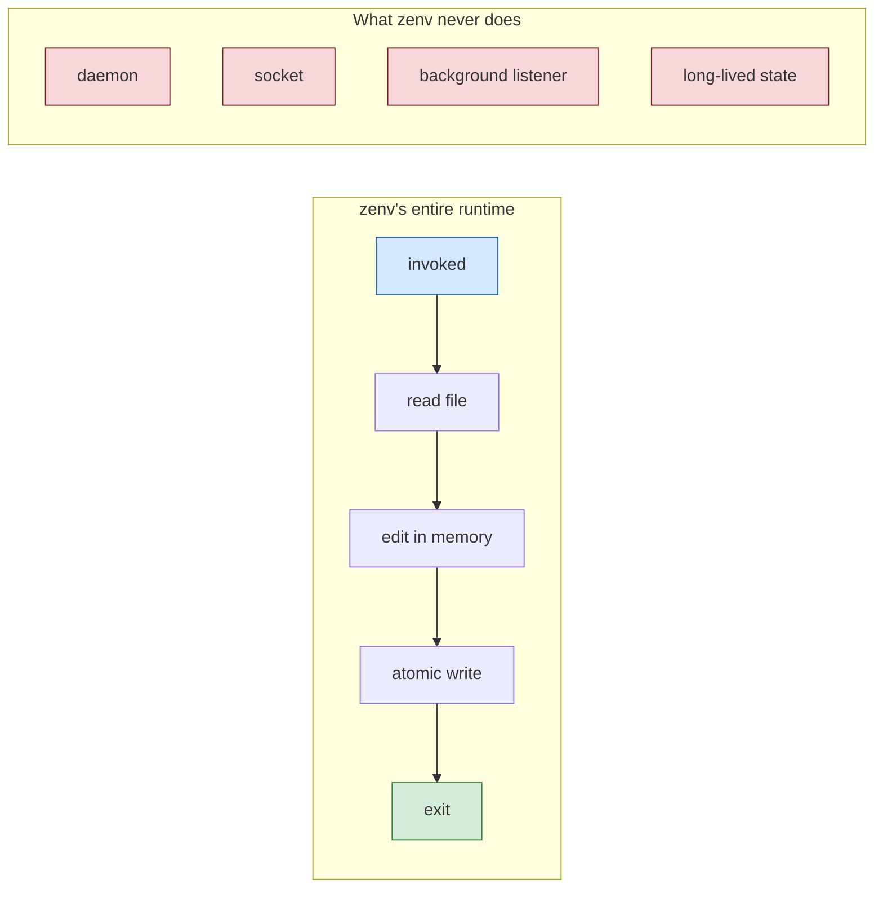

# Chapter 1 — The Parent–Child Wall

Every design decision in zenv is downstream of one fact about Unix that no amount of code can repeal: **a process cannot mutate the environment of its parent.** This chapter exists to make that wall visible, because once you see it, the rest of the system stops looking arbitrary and starts looking inevitable.

## The wall, precisely

When you type a command at the Zsh prompt and press return, the shell does something it cannot undo. It forks a new process — a child — and that child inherits a *copy* of the parent's environment. The child can change its own copy freely. It can add variables, remove them, scribble over them. None of those changes propagate upward. The instant the child exits, its environment dies with it, and the parent's environment is exactly as it was before.

This is not a zenv problem. It is not a Swift problem. It is the Unix process model, and it is the single most load-bearing fact in any tool that tries to manage shell-local state from a separate program.

Consider what a naive secret manager would want to do. The user runs `secrettool set API_KEY abc123`. The natural, ergonomic thing for the tool to do is to put `API_KEY=abc123` into the user's current shell so they can use it immediately. And the wall says: **no.**

## The three doors through the wall

Because the child cannot push upward, any tool that wants to affect the parent's environment has exactly three options. Each carries a cost, and the cost determines the shape of the system that picks it.

**Door 1 — Write a file, ask the user to source it.** The child writes the desired state to a file the shell already reads, then tells the user to reload. The parent shell picks up the change on its own terms. This is honest and portable, but it off-loads a step onto the human.

**Door 2 — Emit shell code to stdout, require an eval wrapper.** The child prints `export KEY="value"` to stdout, and the user invokes the tool through a shell function that pipes its output into `eval`. This is how tools like `direnv` and `rbenv` work. It is seamless once installed, but it demands a wrapper function in `~/.zshrc` that captures and evaluates the tool's output. The tool is no longer a plain command; it is a generator consumed by a shim.

**Door 3 — Mutate a file the shell reads automatically.** Zsh, like Bash, reads `~/.zshenv` on every invocation of every shell — interactive, non-interactive, login, non-login. Writing to `~/.zshenv` is therefore a way to push state into *future* shells without asking. It is also a way to push state into the current shell, on the next reload.

zenv picks Door 2. The hook in `~/.zshrc` runs `eval "$(zenv env)"`. Door 1 remains the fallback for the current session via `source ~/.zshrc`.

## Why zenv takes Door 2

Keychain lookups in `~/.zshenv` would run for every `zsh -c`. They fail silent off a GUI login and add hundreds of milliseconds. Secrets load in interactive shells. Scripts that need them call `eval "$(zenv env)"`.

The current shell still does not pick up a new key until reload. Every successful `set` prints `source ~/.zshrc`.

## The consequence: storage is Keychain

Once you refuse `~/.zshenv` as a secret file, the store is `SecItem` and the shell only sees export lines at eval time.

State lives in Keychain. `zenv env` prints export lines only when a hook or a user asks. Chapter 3 covers `SecItem` CRUD. Chapter 2 explains why Keychain is the rest story and why display masking still matters once values are in the interactive shell. zenv still is not a daemon. It runs, talks to Keychain, and exits.

## What the wall buys you

The wall is a constraint, but constraints clarify. Because zenv cannot push into the parent, it never tries. It never spawns a daemon, never opens a socket, never runs in the background. The program runs only when invoked, does its work, and exits. There is no process to find and kill, no service to restart after an upgrade, no leak surface from a long-lived process holding secrets in memory. The attack surface of a program that runs for fifty milliseconds is smaller than the attack surface of one that runs forever. The parent–child wall, taken seriously, *is* the security architecture.

By the end of this book you will have seen every subsystem of zenv, and you will notice that none of them exist to work around the wall. They all exist to live well *within* it. Storage is a file. Display is rigged. The current shell is reminded to reload. That is the shape of a system that has accepted its constraints instead of fighting them.

## Apply This

1. **Name the wall before you build the ladder.** Before designing a tool that touches parent-process state, write down the constraint that cannot be repealed. For shell tools it is the parent–child boundary; for containers it is namespace isolation; for browsers it is the same-origin policy. The act of naming the wall forces the three or four real options into view and exposes the cost of each.
2. **Pick your door deliberately, then make the cost visible.** Every door through the wall has a cost — a manual step, a wrapper shim, a side effect. Hiding the cost is what produces confusing tools. zenv prints *“run source”* on every successful set because Door 3 has a cost and the cost should not be hidden. Make your tool print its own price tag.
3. **Prefer the door that lets you be stateless.** When the problem allows it, choose the option that requires no daemon and no long-lived process. A tool that exits in milliseconds is easier to reason about, easier to secure, and easier to debug than one that runs forever. Statelessness is often the cheapest door to maintain.
4. **Treat constraints as the security architecture.** The wall is not just a problem to route around; it is a boundary that shrinks your attack surface. Lean into it. zenv holds no secrets in memory between invocations precisely because the wall forbids it from doing anything useful with such memory anyway.
5. **Read the shell manual before assuming.** The distinction between `~/.zshenv` (every shell) and `~/.zshrc` (interactive only) is the kind of detail that determines whether a feature works at 3 a.m. inside a cron job or only at the prompt you happen to be testing in. When you build on a platform, read the platform's loading order yourself. Do not inherit it secondhand.
