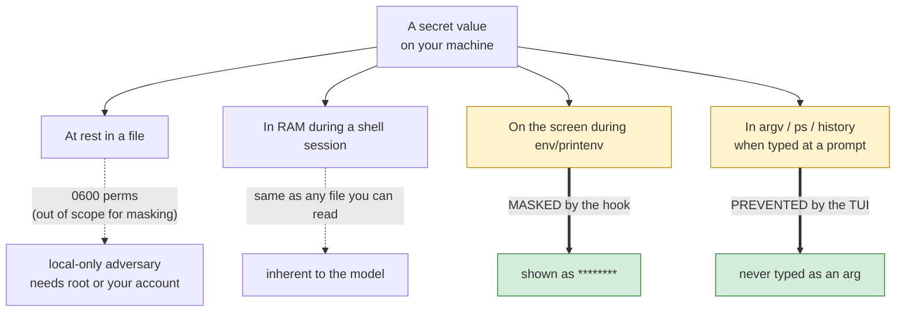
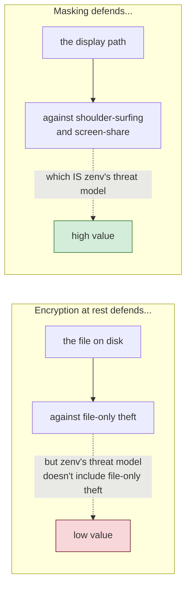

# Chapter 2 — The Threat Model, and the Bet

Chapter 1 ended with a claim worth picking apart: zenv defends secrets at the moment they are *shown*, not the moment they are *saved*. That is the thesis of the whole book, stated as a design decision. But a decision is only as good as the threat model behind it. This chapter makes that model explicit, because the single most common mistake in secret-management tooling is building defenses against the wrong adversary.

## What zenv is actually defending against

A threat model is just an answer to the question: who is the adversary, what can they already do, and what are we trying to stop them from doing next? For zenv, the adversary is not a nation-state, and the threat is not exfiltration of a powered-off laptop. The adversary is *ordinary exposure*, and there are three forms of it that matter.

**Shoulder-surfing.** Someone glances at your screen while you run `env` to debug a build. Without zenv, every secret in your environment scrolls past in cleartext. With zenv, every secret is replaced with eight asterisks. The screen still proves the secrets *are there* — which is what you wanted, when debugging — without leaking *what they are*.

**Screen-share and pair-programming.** The modern, distributed version of shoulder-surfing. You share your terminal in a video call to debug a CI failure with a teammate, and mid-debug you run `printenv API_TOKEN` out of habit. The teammate now has a production credential. zenv's masking hook neuters this entire class of mistake.

**Shell history and process listings.** A secret typed at the prompt enters `~/.zsh_history`. A secret passed as a command-line argument enters `ps` and, on most systems, the process accounting logs. zenv's TUI takes input from a masked prompt so the value never touches the command line at all, which means it never enters argv, history, or `ps`. Chapter 5 covers this in detail.

Notice what is *not* on that list. Root is not on the list — root can read any file regardless of permissions, so defending against root is not a goal. Physical theft of a powered-on machine is not on the list — if the attacker has your unlocked laptop, they have your shell session and your secrets anyway. Backups are not on the list — a secret stored in `~/.zshenv` will be backed up to wherever your home directory is backed up, and zenv does nothing about that. Malware running as your user is not on the list — it can read `~/.zshenv` directly, the same as you can.

This is the uncomfortable part of threat modeling: being honest about what you are *not* defending. A tool that claims to defend against everything usually defends against nothing well.

## The bet, stated as a trade-off

The standard move in secret management is to encrypt at rest. A tool that does this will, on the surface, look more secure than zenv. The secrets file is ciphertext; an attacker who steals the file cannot read it without the key. Why does zenv refuse this?

Because of what encryption *does not* buy you in this threat model, and what it *costs*.

Encryption at rest defends a file that is sitting still. The moment the user wants to *use* the secret — which is the entire reason for storing it — the tool has to decrypt it back into memory, and from there it flows into the shell environment, where it is exposed by `env`, `printenv`, and every child process that inherits it. In other words, encryption at rest defends the file against the one adversary zenv does not care about (someone who has the file but not your account), and does nothing against the adversary zenv *does* care about (someone glancing at your screen while you use the secret).

Meanwhile, the *cost* of encryption is real. It introduces a key. Where does the key live? If it lives on the same machine, you have not gained anything against a local adversary — they take the key with the file. If it lives in a hardware token or a keychain, you have added an interactive unlock step and a dependency on platform-specific APIs. You have also added a decryption path that must itself be defended, because now there is a moment in time when the cleartext is being produced and written into the environment. The complexity budget of encryption is large, and for this threat model it is spent on the wrong adversary.

zenv's bet is the inverse. Skip encryption. Spend the complexity budget on the display path instead. Defend the moment the secret is shown, because that is the moment the actual adversary actually strikes.

The user who needs file-only-theft defense uses Keychain. That is this tool after the Swift port. Encryption at rest is the login keychain, not a homemade cipher. Display masking remains.

## Honest scope, in one table

| Adversary capability | zenv's response | Honest verdict |
|---|---|---|
| Shoulder-surfing / screen-share while you run `env` | Masked to `********` by the hook | **Defended** |
| Typing the secret as a command argument | Prevented: TUI takes it from a masked prompt, never argv | **Defended** |
| Reading `~/.zsh_history` for typed commands | Prevented: value never entered as a command | **Defended** |
| Stealing the file but not your account (file-only theft) | Out of scope; would require encryption + key management | **Not defended** |
| Running code as your user | Out of scope; they can read the file directly | **Not defended** |
| Root on your machine | Out of scope; root reads everything | **Not defended** |
| Compromising your backups | Out of scope; secrets ride along with home backups | **Not defended** |

The right way to read this table is not as a confession of weakness but as a *boundary*. A tool that says yes to everything tends to say nothing well. zenv says no to four classes of adversary on purpose, so that it can say yes to the three it actually cares about without compromise.

The instinct that threatens this discipline is the urge to add defenses until the table has no red rows. Encryption at rest addresses the file-only-theft row; zenv has declined that row, so the defense spends complexity on a threat the tool has chosen not to own. "Could we add it?" is rarely the right question. "Does it serve a row we have committed to?" is. The threat model is the commitment; every later chapter should be read against it.

## The bet, propagated

With the threat model fixed, the rest of the system follows. The storage layer (Chapter 3) is allowed to be plaintext because the file is not the defended surface. The masking hook (Chapter 4) is the load-bearing defense because the display path *is* the defended surface. The TUI (Chapter 5) defends the input path because argv and history are attack surfaces the model cares about. The command surface (Chapter 6) is honest about the parent–child wall because pretending to push into the parent would be a lie, and the migration and doctor commands (Chapters 7 and 8) exist to keep the system in the state the threat model assumes — secrets in the right file, hook installed, permissions correct.

When you read a later chapter and ask "why this way?", the answer is usually here. The threat model is the source code of the design.

## Apply This

1. **Write the threat model as a table, including the rows you decline.** The rows you say no to are more informative than the rows you say yes to. A threat model that lists only defended threats reads as marketing; one that names its non-goals reads as engineering. Reviewers will trust the second and distrust the first.
2. **Match the defense to the adversary's actual move, not to the asset's general scariness.** Secrets are scary, so the instinct is to encrypt them. But encryption defends against a file-thief, and most leak incidents come from a screen-share or a misdirected paste. Ask "what does the adversary *do*, mechanically, to learn the secret?" and defend that exact action.
3. **Refuse defenses that buy complexity without coverage.** A defense that addresses a non-goal is not free even if it "seems more secure." It adds code, dependencies, and failure modes, all spent on a threat you have decided not to own. The cost is real; spend it on a row you have committed to.
4. **Make the bet visible in the UX.** zenv prints *“run source”* after every set because Door 3 has a cost and the cost should not be hidden. The same applies to threat-model decisions: if your tool declines to defend something, say so in the docs, not just in the design meeting. Users deserve to know which rows are red.
5. **Revisit the model when the deployment context changes.** zenv's model assumes a single-user workstation. The day someone deploys it onto a shared multi-tenant host, the "running code as your user" row turns red and the whole model needs rethinking. A threat model is a function of context, not a property of the software. When the context moves, redraw the table.
