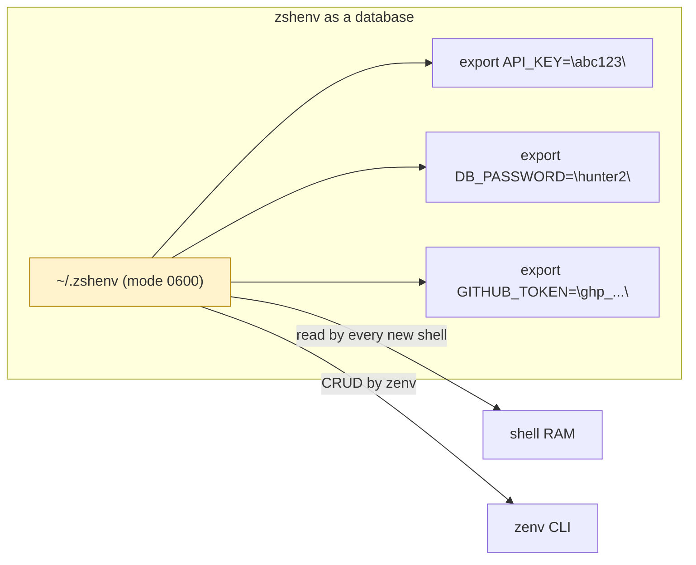
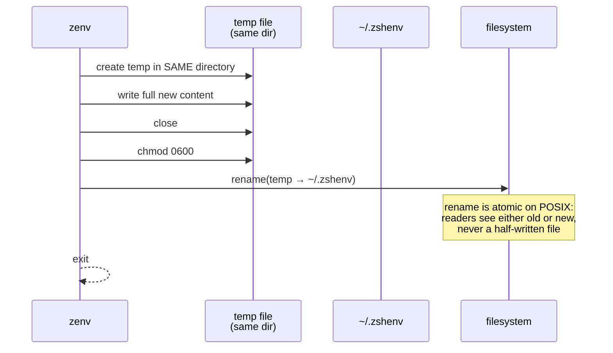

# Chapter 3 — The Storage Layer

This chapter is historical on the file-as-database design. Current zenv stores items in Keychain. The crash-safety and quoting lessons still apply to `zenv env` output, not to `~/.zshenv`.

This is the chapter where zenv is most often underestimated. Having decided (in Chapter 1) that state lives in a file and (in Chapter 2) that the file does not need to be encrypted, we arrive at a surprisingly rich question: how do you turn a shell file into a reliable database without using a database?

## The file is the database

The schema is the shell's own syntax. Each line is `export KEY="value"`, uppercase key, double-quoted value, one per line. There is no index, no header, no delimiter beyond the line break. Any tool that understands shell syntax can read it; any shell that sources it gets the variables for free.



The trade-off against a real database is worth naming. A database gives you transactions, concurrent writers, indexed lookups, and a query language. The flat file gives you none of those. What it gives you, instead, is *legibility* — the user can open the file in a text editor, understand it completely, fix it by hand if zenv is broken, and migrate it to any other tool that reads shell syntax. For a single-user, single-writer, low-throughput store of a few dozen secrets, that legibility is worth more than transactions. zenv is never going to have concurrent writers (each invocation runs only for the moment it takes to do its work and exit), it is never going to need a query language (the queries are "get one", "get all", "set one", "delete one"), and it is never going to outgrow the working set of secrets a single human can hold in their head.

The discipline here is recognizing when "primitive" is the right choice. A database is a commitment to a dependency, a file format, an upgrade path, and a recovery story. zenv refuses all four by staying with the file the shell already reads.

## CRUD by regular expression

With the schema fixed, the operations are simple enough to state in one sentence each.

- **Create / Update** — scan the file for a line beginning with `export KEY=`, replace it if present, append if not.
- **Read all** — scan line by line, match the export pattern, extract the key and value.
- **Delete** — find the matching export line and remove it.

What makes this non-trivial is that the operations are implemented with regular expressions against text the user might one day edit by hand. Two design decisions fall out of that, and both are worth stealing.

**Keys are normalized before any comparison.** Every operation uppercases the key before matching, so `api_key`, `Api_Key`, and `API_KEY` are the same variable. This is not just convenience — it is what makes the regex match safe. If the file contains `export API_KEY=...` and the user types `zenv rm api_key`, the operation has to succeed. Normalization at the boundary (in this case, inside each CRUD method, immediately after entry) guarantees it does.

**The match pattern quotes the key literally.** A naive pattern built by string interpolation would let a malicious or merely weird key inject pattern syntax into the match. The defense is small and absolute: the key is treated as a literal string — any regex metacharacters it contains are escaped — before being interpolated into the pattern. The pattern can then only ever match the exact key, never a fragment of regex.

```text
// Illustrative — the pattern-building discipline (not real syntax)
// Goal: match the exact line 'export SOME_KEY="..."' without letting
//       the key inject regex syntax.

safeKey   = escapeRegexMetacharacters(key)   // e.g. "." becomes "\."
pattern   = "^export " + safeKey + "=\".*\"$"
match the compiled pattern against the file
```

That is two lines of intent, but they encode a real defense. The general lesson — *never interpolate untrusted text into a regex; always quote it as a literal first* — applies far beyond shell-file editors. It is the same discipline you apply to SQL parameters, to shell arguments, to anything where untrusted input becomes structure.

## Deep dive: the atomic write

The hardest requirement of the storage layer is that a crash during a write must not corrupt the file. If the user pulls the power cord halfway through `zenv set`, the worst acceptable outcome is that the new value is not written. The unacceptable outcome is that `~/.zshenv` is left truncated or empty, taking every other secret with it.

The naive write — open the file, truncate it, write the new content, close — fails this requirement catastrophically. Between truncate and close, the file is empty. A crash in that window destroys all secrets.

The atomic write solves it by a small dance with the filesystem.



The dance has four steps, and each one matters for a specific reason.

**The temp file is created in the same directory as the target.** This is not an accident, and it is the step most often gotten wrong by people reinventing this pattern. `rename` is only guaranteed to be atomic *within a single filesystem*. If the temp file lives in `/tmp` and the target lives in the user's home, the two may be on different filesystems, in which case `rename` falls back to copy-then-unlink — and copy-then-unlink has the same crash window as the naive write. By creating the temp in the same directory as the final file, the layer guarantees that `rename` is a true atomic operation on the inode, not a fallback.

**The content is written and the file is closed *before* the rename.** The bytes are flushed to the temp file while the original is still untouched. A crash here leaves a stale temp file in the directory and an untouched `~/.zshenv`. That is the safe failure mode.

**Permissions are set on the temp file *before* the rename, not after.** This ordering closes a subtle window. If you rename first and then `chmod`, there is a moment when the new file exists at its final path with whatever default permissions `CreateTemp` gave it — and on many systems the default is world-readable. For a file full of secrets, that window is unacceptable. Setting `0600` on the temp *before* the rename means the file arrives at its final path already locked down. There is no instant in which the secret file is both visible to the world and present at its real path.

**The rename itself is the commit.** From the perspective of any reader — including any shell that opens `~/.zshenv` in the middle of this operation — the file is either entirely the old content or entirely the new content. There is no half-state. The filesystem guarantees this on POSIX; the layer relies on it.

If any step fails, the cleanup path removes the temp file. The original file is never touched until the very last moment, so the failure modes are all "no change," never "corruption."

This is the kind of detail that looks like paranoia in a code review and looks like professionalism in an incident report. zenv is a tool that writes secrets to a file the user cannot afford to lose; the four-step dance is the minimum that problem demands.

## Deep dive: escape ordering is not commutative

The other subtlety of the storage layer is the escape and unescape pair that wraps every value before it is written and after it is read.

The problem is that a secret can contain any character, and the storage format is a shell double-quoted string. Inside shell double quotes, four characters are special: the backslash, the double quote, the dollar sign, and the backtick. A secret containing any of these would, if written verbatim, either break the shell's parser on the next source or — worse — be silently reinterpreted. A secret value of `my$var` would, on the next reload, become `my` followed by whatever `var` resolved to. That is a corruption of the secret and a quiet one.

The escape function rewrites each of these four characters into a backslash-escaped form before writing. The unescape function reverses the four rewrites on the way back out.

The detail that earns this section is the *order* of the rewrites. They are not commutative, because escaping introduces new backslashes, and the backslash is itself one of the characters being escaped. If you escape the backslash last on the way in, then every backslash you introduced earlier (by escaping a quote, a dollar, a backtick) is itself a literal backslash that the unescape pass will later treat as an escape introducer — corrupting the round-trip.

The correct order escapes backslash *first* on the way in, so that any backslash introduced by later steps is unambiguous; and on the way out, unescapes backslash *last*, so that the other unescape steps see their introducers intact.

A worked example makes the round-trip concrete. Take a secret value containing all four special characters and trace it through the pair:

| Stage | Content | Note |
|-------|---------|------|
| Raw secret (in memory) | `a"\`b` | contains quote, backslash, backtick |
| After escaping `\` first | `a"\\`b` | the one literal backslash is now doubled |
| After escaping `"`, `$`, backtick | `a\"\\`\`b` | the other specials each get their own backslash |
| Stored on disk | `export K="a\"\\`\`b"` | safe inside shell double quotes |
| Read back, unescape backtick/`"`/`$` first | `a"\`b` + `\` | the introduced backslashes before specials are consumed |
| After unescaping `\` last | `a"\`b` | matches the raw secret — round-trip holds |

The general principle, worth more than the specifics of which four characters are special in shell double quotes: **whenever you write an escape function, write the unescape function next to it, and prove to yourself that `unescape(escape(x)) == x` for every input.** The proof is usually an ordering argument, and the ordering argument is usually the bug.

A second property that the round-trip has to maintain is *idempotence on disk*: writing the same value twice should produce the same bytes on disk both times, so that a re-write of an unchanged secret is a no-op rather than a churn. The escape pair as written has this property, and it is worth keeping in mind when extending the set of escaped characters.

## Permissions as a write invariant

The storage layer enforces one more invariant, and it is worth pulling out of the noise: every write is followed by a `chmod 0600`. The atomic write sets the temp file to `0600` before the rename, so the file arrives locked down. But because the layer cannot know what other tools (or a careless `chmod` by the user) might have done to the file in the meantime, every mutating operation re-asserts `0600` as its final step.

This is the right pattern for any invariant you cannot enforce purely by construction: *re-assert it on every write*. The cost is one syscall per mutation, which is invisible. The benefit is that permissions can drift — through a restore from backup, through a copy-paste, through a user "fixing" something — and the next `zenv set` quietly puts them back. Chapter 8's `doctor` command is the user-facing version of the same idea; this is the in-band version, applied on every write whether the user notices or not.

## What the layer refuses to do

As important as what the storage layer does is what it does not do.

It does not lock the file. A real database would acquire a write lock to prevent concurrent modifications. zenv does not, on the bet that no two `zenv` invocations will overlap on a single-user workstation. If they did, last-write-wins would apply, and the layer accepts that. Locking would add complexity to defend against a workload that does not occur in practice.

It does not validate values. Any string that survives the escape function is stored. The layer does not refuse secrets that "look weak" or "match a known leaked password." That judgment is not the storage layer's job; it would be a feature of a higher layer, and zenv does not have that feature.

It does not version history. There is no append-only log, no previous-values table. Once a value is overwritten, the old value is gone. (The `doctor` and `migrate` commands make timestamped *backups* of the files they touch, but that is a separate concern from per-value history inside the file.) If you need secret rotation history, you need a different tool.

Each refusal is a deliberate narrowing of scope, made possible by the threat model in Chapter 2. The layer is small because the requirements are small, and the requirements are small because the problem was scoped honestly.

That is the through-line of this chapter, and the bridge to the rest of the book. The storage layer is allowed to be plaintext, primitive, and permissive precisely because it is *not the defended surface*. The bet from Chapter 2 — defend the moment of display, not the moment of storage — is what makes a flat file of secrets defensible. The defenses themselves live elsewhere: in the masking hook of Chapter 4, which rigs the display path; in the masked prompt of Chapter 5, which rigs the input path. Storage's job is to be safe enough, and no more than that. Everything above it does the rest.

## Apply This

1. **Pick the storage format that matches the read pattern, not the one that matches the write pattern.** zenv's file is read by every shell on the machine, which is far more frequent than any write. Choosing a format the shell reads natively — instead of one convenient for the writer — eliminates an entire translation layer and keeps the artifact legible to humans and tools alike.
2. **Atomic writes have four steps, not two, and the temp file's location is the step people forget.** Create the temp in the same directory as the target, write and close, set permissions, then rename. Each step closes a specific failure window; skipping any one of them reopens that window. The same-directory requirement is what makes `rename` truly atomic rather than a fallback copy.
3. **Set permissions on the temp file before the rename, never after.** The instant a secret file appears at its final path, it must already be locked down. There is no acceptable window in which the file is both at its real location and world-readable, however brief.
4. **For every escape function, write the unescape next to it and prove the round-trip.** The proof is usually an ordering argument about which character is escaped first. Get the order wrong and the round-trip silently corrupts values containing the escaped characters — a bug that will surface only for users whose secrets happen to contain a dollar sign or a quote, and surface as a quiet wrong value rather than a crash.
5. **Re-assert invariants on every write, not just at creation.** Permissions drift; files get restored from backup; users run `chmod`. A storage layer that sets permissions once at creation and trusts them forever will eventually be wrong. Re-asserting on every write is one cheap syscall that turns a fragile invariant into a self-healing one.
