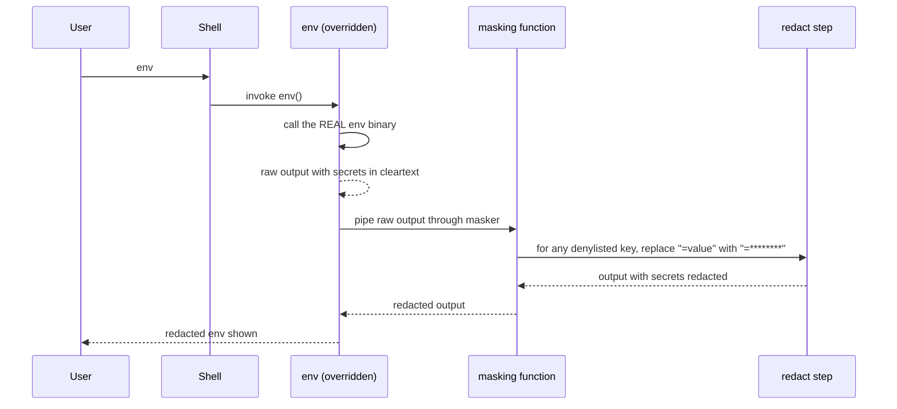
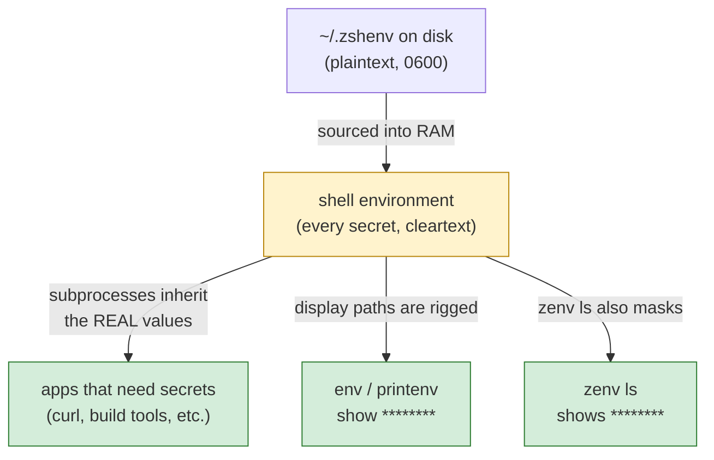
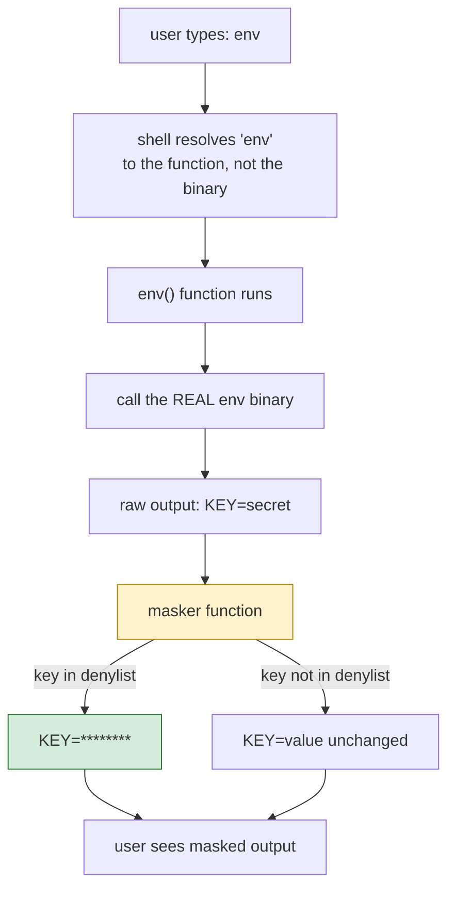
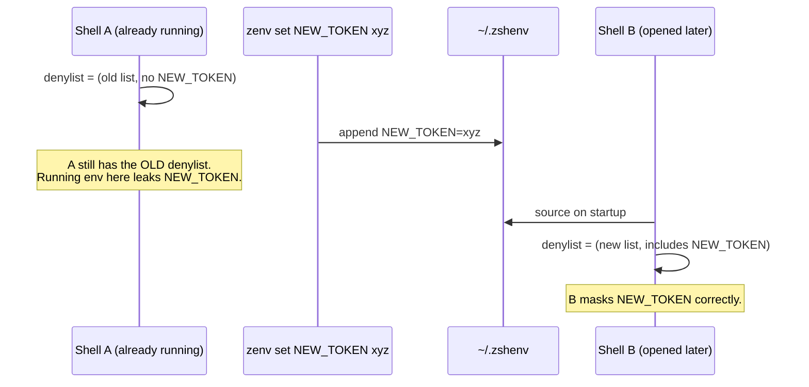

# Chapter 4 — The Masking Hook

This is the chapter the rest of the book has been building toward. Chapter 2 made a bet — defend the moment a secret is *shown*, not the moment it is *saved* — and Chapter 3 built a storage layer that takes the bet seriously by storing secrets in plaintext, on the grounds that the file is not the defended surface. That decision is only coherent if the display path is genuinely defended. This chapter is that defense.

The masking hook is zenv's most clever piece of engineering and its most characteristic design decision. It is also the place where zenv stops being a file editor with opinions and becomes something genuinely original: a tool that *reaches into the shell* and rewrites the commands the user types.

## The problem the hook solves

Consider the world without the hook. The user runs `zenv set API_TOKEN abc123`. The token lands in `~/.zshenv`, mode `0600`. The user opens a new shell, which sources `~/.zshenv`, and `API_TOKEN` is now in the shell's environment, available to every subprocess. Good so far — the secret is usable.

Then the user debugs a failing build by running `env`, and the entire environment scrolls past, including `API_TOKEN=abc123` in cleartext. The user is sharing their screen on a video call. The secret has just leaked.

The storage layer is blameless here. The file is locked down. The threat model identified this exact scenario as the one to defend. What is missing is a defense *at the moment of display*. The hook is that defense.



The secret remains usable — every subprocess still inherits the real value — but the casual display paths that a human would run, `env` and `printenv`, no longer reveal it.

## The inversion: load into RAM, rig the display

The hook embodies an inversion worth stating plainly, because it is the conceptual heart of the whole book.

The naive approach to "hide a secret" is to keep the secret somewhere hidden and reveal it on demand. zenv does the opposite. It loads every secret into the shell's RAM, in cleartext, where any subprocess can use it. Then it rigs the *output channels* so that a human glancing at the screen sees only asterisks.

The secret is fully present, fully usable, and fully available to any program that genuinely needs it. It is only hidden from the human looking at a screen. This is exactly what the threat model in Chapter 2 calls for: the adversary is shoulder-surfing, and shoulder-surfing reads screens. Defending the screen — the actual attack surface — while leaving the secret usable is the bet, paid in full.



Notice what is *not* defended: a subprocess that genuinely wants the secret can read it from its inherited environment and exfiltrate it. zenv does not try to stop this, because the threat model in Chapter 2 explicitly declined the "code running as your user" row. The hook defends display, not access. Getting this distinction right is the difference between a coherent security posture and a false sense of safety.

## Reading the hook, line by line

The hook is small enough to read in full, and it is worth reading carefully because every line does a specific job.

### Step 1: build the denylist of keys to mask

The first thing the hook does is run `zenv keys` and `eval "$(zenv env)"`. It does not read `~/.zshenv`.

```text
# Illustrative — the key-extraction step (pattern only, not real syntax)
# Goal: from a file of "export KEY=value" lines, produce an alternation
#       matching any one of the keys:  KEY_A|KEY_B|KEY_C

denylist = ""
for each line in secrets_file:
    if line matches "^export (KEY)=":
        denylist = denylist + KEY + "|"
drop the trailing "|" from denylist
```

Three small operations compose here: extract the key part of each export line, join the keys into one pipe-delimited string, strip the trailing pipe. The output is an alternation that matches any one of the keys. The values are never read in this step — only the names.

This value is stored in an environment variable (conventionally underscore-prefixed, to signal "this is internal machinery, not user state") so that the masking function does not have to re-read the file every time `env` is invoked.

### Step 2: load the real values into RAM

With the keys known, the hook evals `zenv env`. That is where secrets enter the interactive shell.

```text
# Illustrative — load the real values (pattern only)
if the secrets file exists:
    source it   # every export line now defines a live variable in this shell
```

This step is what makes the inversion work. After this line, every variable in the file is in the shell's environment, available to every subprocess. The hook has not hidden anything yet — it has, if anything, made the secrets *more* present than they would have been without it, because Zsh sources `~/.zshenv` on its own anyway. The masking has not happened; the load has.

The hook does not re-source a secrets file. Load is one `zenv env` process.

### Step 3: define the masker

The third step defines a small shell function whose job is to take a stream of `KEY=value` lines and replace the value with eight asterisks whenever the key matches the denylist built in step 1.

```text
# Illustrative — the masker function (pattern only, not real syntax)
function mask_stream:
    if the denylist is non-empty:
        for each line on stdin:
            if line matches "^(" + denylist + ")=":
                print (the key part) + "=" + "********"
            else:
                print the line unchanged
    else:
        copy stdin to stdout unchanged   # nothing to mask → pass through
```

Two details deserve attention.

The function is a *no-op when there is nothing to mask.* If `~/.zshenv` is empty or missing, the denylist is empty, and the function falls through to copying stdin to stdout unchanged. This is deliberate: a broken or absent secrets file must not break the user's `env` command. The failure mode of the hook is "mask nothing," not "produce no output."

The replacement is unconditional on the value. The masker does not look at the value to decide whether to mask it; it masks *every* value of *every* key in the denylist, uniformly. This matters because anything value-dependent (mask only short values, mask only values matching a pattern, mask only values that "look like secrets") reintroduces the judgment that the threat model explicitly declined. The hook is dumb on purpose: if the key is in the file, its value is replaced, period.

### Step 4: override the display commands

The final step is where the hook reaches into the shell and rewrites the user's commands.

```text
# Illustrative — the override pattern (pattern only, not real syntax)
# Define a function with the same name as a standard command, so the
# shell resolves the user's call to the function instead of the binary.

function env:
    call the REAL env binary, capturing its raw output
    pipe that raw output through the masker
    print the masked result

# the same shape applies to every command the hook wants to wrap
```

Each override defines a shell function with the same name as a standard command. Inside the function, the real binary is reached through a "call the underlying command, not this function" escape hatch — without that escape, the function would recurse forever, calling itself instead of the binary it is trying to wrap. The real binary's output is piped through the masker, and the masked result is what the user sees.

This is a shell trick worth knowing in its own right. Defining a function named `env` does not delete the `env` binary; it shadows it within the current shell. The binary is still reachable through `command env`, which is the escape hatch that makes the override safe. The pattern generalizes to any command you want to wrap transparently: define a same-named function, call the real binary with `command`, transform the output.



## What the hook does not override

The overrides cover `env` and `printenv` — the two commands a user typically runs to *list* the environment. They do not cover everything.

`echo $API_TOKEN` is not masked. The shell expands `$API_TOKEN` to its real value before `echo` ever runs, and by then it is just an argument to a command that has no idea it is handling a secret. zenv cannot intercept this without redefining `echo`, which would break an enormous amount of legitimate use.

A subprocess that reads its own environment directly — `os.Getenv` in Go, `environ` in C, `process.env` in Node — is not masked. The secret is in the subprocess's inherited environment in cleartext, exactly as intended, because the subprocess is the legitimate consumer of the secret.

`set`, in some shells, prints the environment and would not be masked. zenv scopes its overrides to the commands the threat model cares about: the ones a human runs to see what is in the environment, during a debug session, possibly on a shared screen. It does not try to be airtight against every conceivable disclosure path — a determined disclosure will always find a way the hook does not cover, and the threat model in Chapter 2 declined that adversary anyway. The discipline is to defend the paths your model actually identifies, well, rather than ten paths unevenly. Every additional override is a new place to break the user's shell and a new false sense of safety.

## An honest limitation, named plainly

The hook has one consequence that bites every user eventually, and the book would be dishonest to hide it.

The denylist of keys is built *when the shell starts*. The hook reads `~/.zshenv` once, builds the denylist, and never reads it again. If the user runs `zenv set NEW_TOKEN xyz` in one terminal, the new token is written to `~/.zshenv` and will be loaded by the *next* shell — but a shell that was already running will not have `NEW_TOKEN` in its denylist. That shell's `env` output will show `NEW_TOKEN=xyz` in cleartext, because the running shell does not know that `NEW_TOKEN` is now a secret to mask.



This is not a bug. It is a direct consequence of the design. The denylist is a snapshot, because rebuilding it on every `env` invocation would mean re-reading the secrets file on every `env` invocation, which is both slow and surprising. zenv chooses the snapshot, accepts the staleness, and tells the user plainly: after adding a new secret, restart the terminal (or re-source the file that installs the hook) to refresh the denylist. This is the same honest-UX principle from Chapter 1 — the cost of the design is printed, not hidden.

A note to avoid confusion, because two different reminders appear in this book. The `set` command's *“run `source ~/.zshenv`”* reminder (Chapter 6) is about **usability** — it loads the new value so the current shell can use it. The hook's *“restart to refresh”* advice in this section is about **masking** — it rebuilds the denylist so the new key gets redacted on display. Two different refresh problems, two different reminders. Both are the price of the parent–child wall from Chapter 1, paid for two different purposes.

The broader point is that *any* snapshot-based defense has a staleness window, and the right response is almost never to make the snapshot fresher (which usually means re-reading secrets more often, undermining the defense) but to make the staleness visible and tell the user how to refresh. zenv takes the second path.

## The hook as a shell extension point

Step back and look at what the hook actually is. It is not a feature of the Go binary. The binary does not implement masking; the binary writes a file and installs a snippet of shell code into the user's interactive-shell config. The masking is done by the shell, at shell startup, using shell primitives (text filters, function definitions). zenv-the-binary's only job, with respect to masking, is to *plant* the hook and keep it planted.

A natural question, given Chapter 1's distinction between `~/.zshenv` (sourced by every shell) and `~/.zshrc` (sourced by interactive shells only): *why does the hook live in `~/.zshrc` rather than `~/.zshenv`?* The answer is that the hook overrides interactive commands — `env` and `printenv` are things a human types at a prompt. A non-interactive shell, running a script or a cron job, never invokes those commands interactively and has no need for the masker; it just wants the variables loaded, which `~/.zshenv` already handles. Installing the hook in `~/.zshrc` scopes the masking machinery to exactly the shells that benefit from it, and leaves non-interactive shells untouched. The storage file (`~/.zshenv`) and the display machinery (`~/.zshrc`) are separated for the same reason storage and display are separated throughout this book: they have different audiences.

This is a deeper pattern than it looks. zenv extends the shell rather than replacing it. It does not ask the user to run a custom shell. It does not require a daemon. It writes a few lines of portable shell into the file the shell already reads, and from then on the shell does the work. The binary can be uninstalled, the daemon can be absent, the operating system can be reinstalled — as long as the hook's host file survives, the masking survives, because the shell is doing it.

The cost of this approach is that the hook lives in a file the user controls and can break. A user who hand-edits `~/.zshrc` can delete the hook by accident, or paste conflicting function definitions over it. Chapter 8's `doctor` command exists precisely to detect and repair this. The benefit is that the defense runs in the shell's own process, with no external dependency, every time the shell starts. For a defense that has to be present at the exact moment of display, that placement is exactly right.

## Apply This

1. **Defend the display path when the asset must remain usable in the clear.** When the threat is observation and the legitimate use requires the cleartext to be present (secrets in a shell, credentials in a debugger, PII in a log viewer), masking at the display path beats encryption at rest. The asset stays usable; only the casual leak is closed.
2. **Override commands by shadowing them, not by replacing them.** Defining a shell function with the same name as a command shadows the command within the shell; `command <name>` reaches the real binary. This lets you wrap a command transparently without losing access to the original. The pattern works in any shell with function override and a `command` builtin, and it is the least invasive way to inject behavior into existing workflows.
3. **Make the failure mode of a defense be the safe one.** zenv's masker falls through to `cat` when there is nothing to mask, so a broken secrets file produces an unmasked `env` rather than a broken `env`. The safe failure mode here is "no masking" because the alternative — "no output" — would break the user's shell. Always ask: when this defense fails, what does the user get? Make sure it is something they can work with.
4. **Scope your overrides to your threat model and resist extending them.** Masking `env` and `printenv` defends screen-share leaks; masking `echo` would break legitimate use and still not stop a determined disclosure. Every override is a maintenance burden and a false-safety risk. Defend the paths your model actually identifies, and document the paths you deliberately do not cover.
5. **Snapshot defenses have a staleness window; make the window visible, not invisible.** Re-reading the secrets file on every `env` would undermine the defense; rebuilding the denylist on shell startup creates a window where new secrets are unmasked in already-running shells. The right response is to print a "restart to refresh" reminder, not to silently accept the window or to silently close it by re-reading secrets. Honesty about staleness is a feature.
