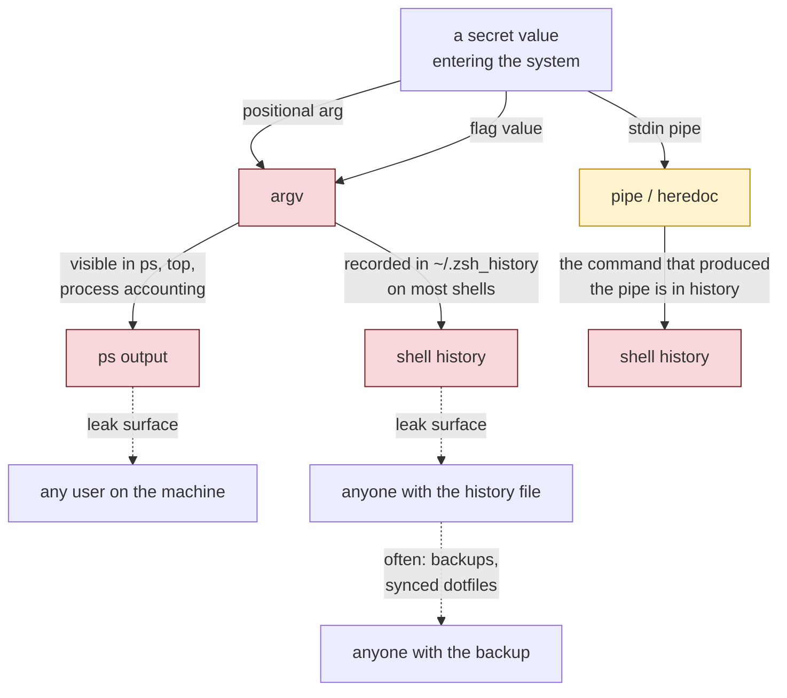
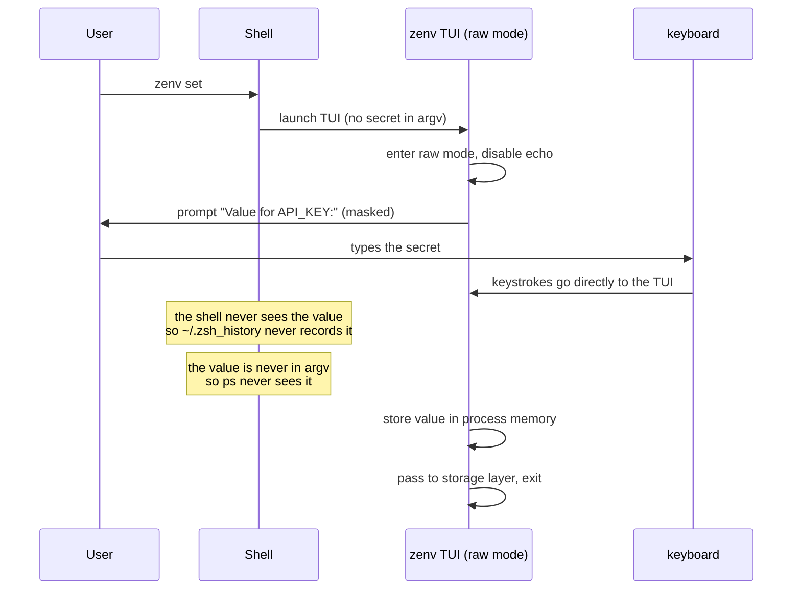
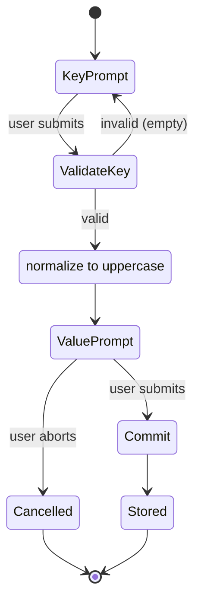

# Chapter 5 — The Secret Never Typed

Chapter 4 rigged the display path so that secrets already in the environment would not leak through `env` or `printenv`. That closes one attack surface. This chapter closes another: the *input* path, the moment a new secret enters the system.

The threat here is subtler than shoulder-surfing, and the defense is more interesting than "use a password field." The defense is a categorical refusal to let the secret touch any of the standard command-line channels, on the grounds that every one of those channels is recorded somewhere.

## The input surfaces a CLI normally has

A CLI that wants to accept a value from the user has, broadly, three channels to choose from.

**Positional arguments** — `zenv set API_KEY abc123`. The value is in `argv`.

**Flags** — `zenv set --key API_KEY --value abc123`. The value is still in `argv`.

**Standard input** — `echo abc123 | zenv set API_KEY`. The value is in a pipe.

All three are reasonable for ordinary values. All three are catastrophic for secrets, because all three leave traces.



The argv leak is the one most people miss. On a multi-user system, any process can read the command-line arguments of any other process owned by the same user (and on many systems, of any process at all, depending on `ps` permissions). A secret in `argv` is briefly visible to every process running on the machine during the lifetime of the command. Even on a single-user laptop, the process accounting subsystems and the shell's own history record argv for later inspection.

The history leak is the one most people know about and still underestimate. `~/.zsh_history` is a flat file of every command typed at the prompt. It is read by every new shell, often synced across machines through dotfile management, and routinely backed up. A secret typed at the prompt joins this file and stays there, in cleartext, traveling wherever the history file travels, until the user notices and removes it by hand — which they rarely do.

The stdin channel avoids argv but does not avoid history, because the *command that sets up the pipe* (`echo abc123 | zenv set ...`) is itself recorded. Pipes hide the value from `ps` but not from history.

zenv's TUI exists to refuse all three channels.

## The refusal, and its UX cost

The interactive form takes the key and the value from a full-screen prompt, not from the command line. The value is read with the input echo set to password mode, so the typed characters do not appear on screen. The form runs in the terminal's raw mode, reading keystrokes directly, which means the value never becomes an argument, never becomes a line of stdin, and never becomes a line of shell history.



Compare the leak surfaces to the three channels above. The value is not in argv. The value is not in history. The value is not in any pipe. The only places the secret exists are the user's short-term memory, the keyboard events while typing, and the short-lived zenv process's memory — which dies the moment zenv exits.

This is a categorical difference, not a matter of degree. A secret typed as `zenv set API_KEY abc123` and a secret typed into a masked prompt are not "a little differently exposed"; they are differently exposed in kind. The first is recorded in at least two durable stores (history, process accounting); the second is recorded in none.

The cost is real and should not be minimized. Refusing command-line input means the tool cannot be scripted in the obvious way. A CI job that wants to provision a secret cannot simply call `zenv set API_KEY $VALUE` — there is no way to pass `$VALUE` non-interactively, by design. The decision is a deliberate trade of scriptability for safety, and it is the right trade *for a tool whose primary use case is a human typing a secret once*. zenv is not designed for headless provisioning; it is designed for the human at the keyboard, and for that user the interactive form is exactly right.

## The masked prompt as a security boundary

The detail that elevates the masked prompt from a UX nicety to a security boundary is that the masking is enforced by the input library, not by the application code. The TUI sets the input field to "password echo mode," which means the library draws a fixed placeholder (a dot, an asterisk, or nothing) for each keystroke, regardless of what the keystroke actually was. The application code never has to remember to mask — the mask is a property of the input mode.

```text
// Illustrative — setting password echo mode on an input field
// The library handles the masking; the application just reads the value.

field := NewInput().
    Title("Value for " + key).
    EchoMode(Password).   // <- the security boundary
    Value(&secret)
form := NewForm(field)
form.Run()
// 'secret' now holds the cleartext; the screen showed only dots.
```

This is the right place for the boundary. If masking were the application's responsibility, every code path that touched the value would be a place to accidentally print it. Putting the mask at the input layer means the application code can be as sloppy as it likes about the value in memory — within the lifetime of the process, which is short — and the screen still only ever shows dots. Defense at the boundary beats vigilance at every point.

There is a subtler point here too. The same library call that masks the input is what makes the prompt usable for a secret in the first place. Without masking, an interactive prompt would be *worse* than command-line input, because the secret would be visible to anyone glancing at the screen for the entire duration of entry. The masked prompt is what closes the shoulder-surfing-during-entry hole that the threat model in Chapter 2 identified. Two defenses, one mechanism.

## The two-step form

The form is split into two sequential prompts rather than one combined screen: first the key, then the value. This is not arbitrary; it reflects a real property of the value prompt.

The value prompt's title includes the key the user just entered — `Value for STRIPE_SECRET_KEY`. By the time the user is typing the value, they have already confirmed what variable they are setting. This matters because a common mistake with secret entry is typing the right value into the wrong variable's slot. Splitting the form into two steps, with the second step explicitly echoing the key from the first, makes this mistake harder to make. The user has to acknowledge "I am now typing the value for STRIPE_SECRET_KEY" before they type it.



The form also normalizes the key to uppercase at the moment of validation, before the value is ever asked for. This connects to a theme from Chapter 3 — keys are normalized at the boundary — but here it has an additional UX payoff: the value prompt's title shows the canonical form of the key, so the user sees exactly how it will be stored, with no ambiguity about case.

## The road not taken: a non-interactive flag

It is worth being explicit about the option zenv declined, because reviewers will ask.

The natural feature request is `zenv set KEY VALUE` or `zenv set --key KEY --value VALUE` for scripting. Every argument for it is reasonable: automation, provisioning, idempotent setup scripts, integration with configuration management. zenv refuses, and the refusal is load-bearing for the threat model.

Allowing the value on the command line, even optionally, would re-open every leak surface the TUI exists to close. A user who *can* pass the value as an argument eventually *will*, because it is more convenient than the interactive form, and the moment they do, the secret is in argv and history. The feature would not be an alternative to the TUI; it would be a regression of the TUI's guarantees, dressed up as a convenience.

The discipline here is the same as in Chapter 2's threat model: a feature is not just what it does, it is what it *enables*. A `--value` flag enables the user to bypass every defense the TUI provides, and on a long enough timeline, that is exactly what it will be used for. Refusing the feature is refusing the regression.

If a user genuinely needs headless provisioning — and they might, for legitimate reasons — the honest answer is "use a different tool for that workload," not "we will quietly undermine our own security model to be convenient." zenv is a tool for a human at a keyboard; the scope is the scope.

## Cancellation as a security feature

One more detail of the form is worth noticing: cancellation is silent and safe. If the user starts the form, gets distracted, and aborts with the escape key, nothing is written, nothing is partially committed, and the command exits cleanly with no output.

This is the same *silent-cancel convention* that the next chapter will examine in the command layer, but it is worth flagging here because of what it implies for the input path. A partially-entered secret is not stored. A form aborted before the value is submitted leaves no trace — no temp file, no partial write, no "are you sure you want to discard your input" prompt that would itself display the value. The form is atomic from the user's perspective: either it completes and the secret is stored, or it is aborted and nothing happened.

This is a small thing, but it is the right small thing. The input path's job is to take a secret from the user's head and land it in `~/.zshenv` without leaking it on the way. Atomicity — either the whole trip happens or none of it does — is part of what makes that path trustworthy.

## Apply This

1. **Refuse the input channels that record, when the input is a secret.** argv, history, and pipes are all recorded somewhere. For a secret, none of them are acceptable. An interactive masked prompt reads directly from the terminal in raw mode, which is the only channel that is not durably logged. The refusal is the security feature; the prompt is just the UX that makes the refusal usable.
2. **Put the mask at the input layer, not the application layer.** Setting an input field to password-echo mode makes masking a property of the field, not a responsibility of every code path that touches the value. Defense at the boundary survives sloppy application code; defense in the application code does not.
3. **Weigh features by what they enable, not just what they do.** A `--value` flag for scripting does what it says. It also enables every user to bypass the input defense by accident or for convenience. The right question is not "is this feature useful" but "does this feature undermine a guarantee we have committed to." When the answer is yes, refuse the feature even when the use case is legitimate — and point users with that use case to a different tool.
4. **Confirm the target before accepting the secret.** Splitting a secret-entry form into "what variable" then "what value," with the second prompt explicitly echoing the first, prevents a class of mistakes where the right value lands in the wrong variable. For secrets, the cost of mis-targeting is high; the cost of an extra prompt is low.
5. **Make cancellation atomic and silent.** A partially-entered secret that survives an abort is a leak waiting to happen. The form should either complete the entire trip from keystroke to file or leave no trace at all. No partial writes, no confirmation prompts that re-display the value, no "discard your input?" dialogs. Either the secret landed, or nothing happened.
