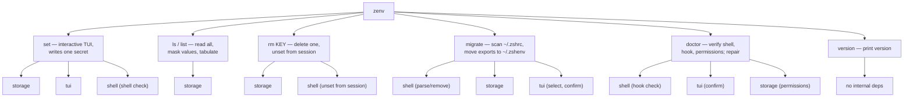
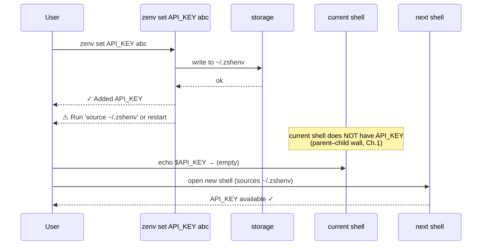

# Chapter 6 — The Command Surface

The previous chapters each took one subsystem and built it out: storage (Chapter 3), masking (Chapter 4), the input path (Chapter 5). This chapter steps up a layer, to where those subsystems meet the user. It is the command surface — the Cobra subcommands that translate intents like "set a secret" or "list what I have" into the appropriate sequence of storage, TUI, and shell operations.

The command surface is where zenv's small size becomes a virtue. There are only a handful of commands, each does one thing, and each follows the same handful of conventions. The interesting content of this chapter is not any one command but the conventions themselves — and one convention in particular that is easy to miss and that does more work than it looks like.

## A surface small enough to hold in the head

The full command surface is: `set`, `ls`, `rm`, `migrate`, `doctor`, `version`. Each takes at most one positional argument. There are no flags on the user-facing commands (the root command has only the standard `--version`), no subcommands-of-subcommands, no modes or profiles.

This is a deliberate scoping. A CLI is an API, and like any API it is easier to grow than to shrink. Every command added is a command documented, tested, maintained, and explained to new users. zenv resists the instinct to add commands for hypothetical workflows and instead ships the smallest surface that covers the actual user journeys identified in the product spec.



The cost of a small surface is that some workflows require composing commands the user has to know about. There is no `zenv rotate`, for example — rotation is `rm` then `set`. There is no `zenv export` — exporting is "open a new shell, which sources `~/.zshenv` for you." The benefit is that the six commands compose transparently, because each is simple enough to reason about completely, and a user who knows the threat model can predict what each command does without consulting the docs.

Restraint is the discipline here. The first version of a CLI should be smaller than the team thinks it should be. The commands that turn out to be necessary will reveal themselves through user feedback; the commands that turn out to be unnecessary would have sat there forever, eating documentation budget and confusing new users.

## The silent-cancel convention

Now the detail that does more work than it looks like. Every zenv command that can be interrupted by the user handles the interruption the same way: it returns `nil`.

Consider `zenv migrate`. It opens a multi-select dialog. The user reads the list, decides now is not a good time, and presses escape. The TUI returns an "aborted" error. The command catches that error and returns `nil` from its `RunE`. Cobra, seeing `nil`, prints nothing and exits with status zero. The user's terminal is clean: no error message, no partial output, no indication anything went wrong, because nothing went wrong. The user cancelled; that is a legitimate outcome, not a failure.

```text
// Illustrative — the silent-cancel pattern, repeated across commands

func runSomeCommand(cmd, args) error {
    confirmed, err := confirmWithUser("Do the thing?", "...")
    if err != nil {
        return nil   // <- user cancelled; this is not an error
    }
    if !confirmed {
        return nil   // <- user said no; this is not an error
    }
    if err := doTheThing(); err != nil {
        return fmt.Errorf("do the thing: %w", err)  // <- genuine failure
    }
    return nil
}
```

Compare to the naive alternative, where the aborted error is returned directly. Cobra would print `Error: aborted by user` to stderr. The user, who simply changed their mind, would see an error message and an exit code suggesting something broke. The terminal would be polluted with output that adds no information. Worse, in a script, the non-zero exit code from a user-cancelled interactive prompt would surface as a script failure, even though no failure occurred.

The convention resolves a real ambiguity in CLI design: *is a user cancellation an error?* zenv's answer is no. A cancellation is a legitimate termination of an interactive flow, equivalent to the user saying "I have decided not to do this." Treating it as an error conflates user intent with system failure, and the conflation shows up everywhere — in polluted terminals, in misleading exit codes, in scripts that report failures that never happened.

The same shape appears whenever a command has an interactive component, and the author has to decide what the abort path returns. The right default is `nil`, with no output, unless the cancellation itself leaves the system in a state worth reporting. zenv applies this default uniformly, and the uniformity is itself a feature: a user who learns that escape-then-clean-exit works in `migrate` will expect it to work in `doctor` and `set`, and they will be right.

## Error wrapping as documentation

When a real error does occur, zenv wraps it before returning. The wrapping is not for control flow — it does not change what Cobra does with the error — but for diagnosis. Each layer adds the context that layer has, so the final message reads as a stack of explanations.

```text
// Illustrative — error wrapping that adds context at each layer
// The innermost error says WHAT failed; each wrap says WHY at that layer.

// storage layer
return wrap("could not commit the write: %w", err)

// command layer
return wrap("could not save the secret: %w", storageErr)

// final output to the user
// "could not save the secret: could not commit the write: <syscall detail>"
```

Two small disciplines make this work. First, the wrapping uses `%w`, not `%s` or `%v`. The `%w` verb preserves the original error so that callers can use `errors.Is` and `errors.As` on it; `%v` flattens the error to a string and loses the type information. For a small program this rarely matters, but using `%w` consistently is a cheap habit that pays off the day someone needs to branch on an error type.

Second, each wrap adds *new* information, not a restatement. The outer wrap says what the tool was trying to do; the middle wrap says where in the storage layer it broke; the innermost error says why. If a wrap merely restated the inner error in different words, it would be noise. The discipline is to ask, at each wrap, "what does this layer know that the inner layer does not?" and to add exactly that.

This is the opposite of the silent-cancel convention, and the contrast is the point. Cancellation is silent because it is not a failure. Genuine errors are loud and well-explained because they are exactly the moments when the user needs information. The two conventions, taken together, produce a tool that is quiet when nothing is wrong and verbose when something is.

## The honest `source` reminder

Every successful `set` ends by printing a line the user has seen a hundred times:

> ⚠ Run `source ~/.zshenv` or restart your terminal to use this variable.

This is the most user-visible consequence of the parent–child wall from Chapter 1, and it is worth pausing on why it is printed every time, even for users who know it by heart.

The reminder is honest UX. The parent–child wall means zenv cannot make the new secret available in the current shell; only sourcing or restarting can. The alternative to printing the reminder is to print nothing, on the theory that the user already knows. But "the user already knows" is the assumption that produces support tickets — the user runs `zenv set`, sees the success message, immediately tries to use the secret, and is surprised when it is not there. The reminder costs one line of output on every set and saves an entire class of confusion.



The reminder is also where the philosophy of the tool becomes audible. zenv does not pretend to be magic. It does not claim that the secret is "now available everywhere," because it is not. It tells the user, plainly, what they need to do to make the secret usable, and it tells them every time, because the cost of the reminder is small and the cost of silence is paid in confused users.

This applies to any tool that operates against a constraint the user cannot see. The constraint is invisible; the workaround is not. Print the workaround. Print it every time. The users who know will ignore it; the users who do not will be saved. The asymmetry favors verbosity.

## Commands are thin; the layers do the work

One last structural point, which sets up Chapter 9. The command functions in zenv are short. They do not contain the logic of storage, or masking, or input; they orchestrate calls into the layers that do. A command function reads like a recipe: check the shell, show the form, save the value, print the result.

This thinness is what makes the system legible. A reader who wants to understand what `set` does can read the command function in thirty seconds, because the function names each step and delegates the implementation. A reader who wants to understand *how* a step works drops one layer down. The command layer is the table of contents; the lower layers are the chapters.

The discipline is to keep the command layer thin even as features accrete. The temptation, when adding a feature, is to put the logic in the command function because that is where the feature is being added. The right move is to push the logic down into the appropriate layer and keep the command function as orchestration. This is harder in the moment and easier over the life of the project, because logic in the command layer duplicates, hides behind conditionals, and resists testing in a way that logic in a layer does not.

## Apply This

1. **Treat user cancellation as success, not failure.** When an interactive flow is aborted, return `nil` from the command and print nothing. The user changed their mind; that is not an error, and reporting it as one pollutes the terminal and breaks scripts. Reserve error returns and error output for genuine failures, and the signal-to-noise ratio of your tool goes up sharply.
2. **Wrap errors with `%w` and add new context at each layer.** The innermost error says what broke; each wrap says why at that layer. Use `%w` (not `%v`) to preserve the type for callers who want to branch on it. At each wrap, ask what this layer knows that the inner one does not, and add exactly that — never a restatement.
3. **Print the workaround for every constraint the user cannot see.** If the tool operates against a limitation the user cannot observe (the parent–child wall, a propagation delay, a caching layer), print the workaround every time, not just the first. Users who know will ignore it; users who do not will be saved. The asymmetry favors repetition.
4. **Ship a command surface smaller than the team thinks it should be.** The first version of a CLI should cover the documented user journeys and nothing more. Hypothetical workflows accumulate into commands that sit there forever, eating documentation and confusing new users. Real workflows reveal themselves through feedback; ship small and grow on evidence.
5. **Keep the command layer thin enough to read as a table of contents.** Command functions should orchestrate calls into lower layers, not implement logic. When adding a feature, the discipline is to push the logic down into the appropriate layer rather than inlining it in the command. The reward is a command layer a reader can scan in seconds to understand what a command does, dropping into layers only when they want to know how.
