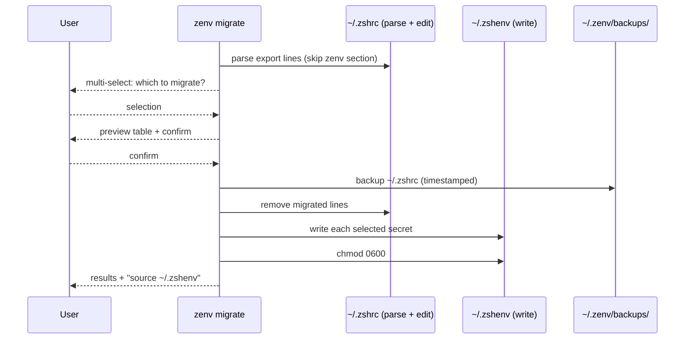
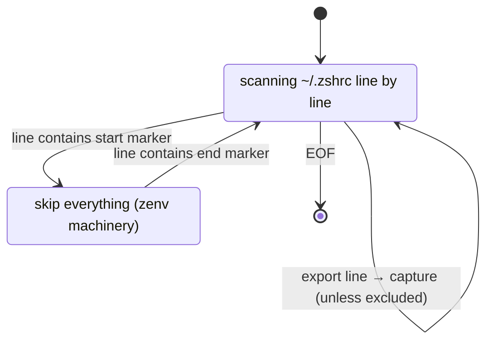
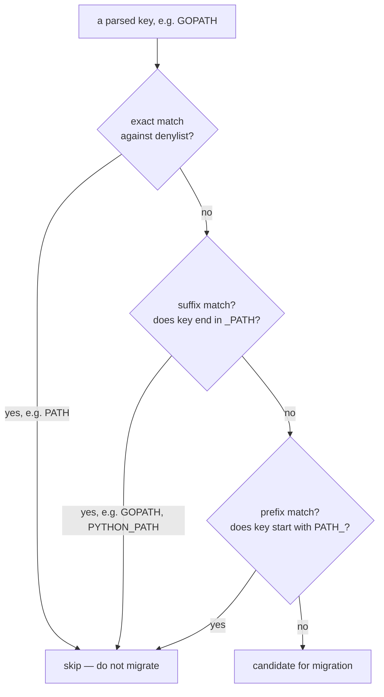
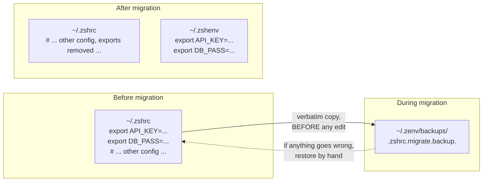
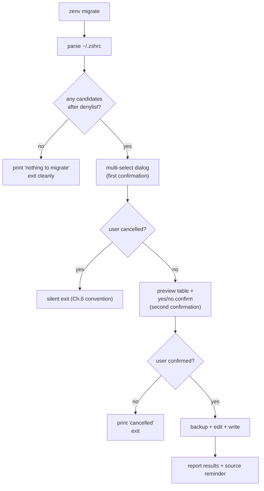

# Chapter 7 — Migration

The previous chapters built a Keychain store. This chapter is about how a user gets there from `export` lines in `~/.zshrc`.

Migration is also where the system encounters the messiness of real shell files. The previous chapters could assume `~/.zshenv` was written by zenv and therefore well-formed. Migration cannot assume that about `~/.zshrc`. The interesting content of this chapter is the heuristics zenv uses to behave well on input it does not control.

## The one-way ratchet

Migration moves `export` lines from `~/.zshrc` into Keychain, then removes them from `~/.zshrc`.

The operation is a ratchet because it only turns one way. The reverse — moving secrets from `~/.zshenv` back to `~/.zshrc` — is not supported, and would be a regression of every guarantee zenv provides. Tools that move state to a better home should resist the temptation to be symmetric. Symmetry sounds principled; in practice it lets users undo improvements by accident.



The flow has the shape of every zenv command — check, interact, perform, report — but with one extra step that the other commands do not have: the parse. Migration reads a file zenv did not write, and that is the interesting part.

## Parsing a file you do not control

`~/.zshrc` is wild. Users have been editing it for years, by hand, with copy-pasted snippets from blogs and Stack Overflow and colleagues. It contains comments, conditionals, function definitions, plugin-loader invocations, and `export` lines in every conceivable format. Migration has to find the `export` lines, extract their keys and values, and leave everything else untouched.

The parser is a single regular expression matching the common forms of `export`:

```text
# The shape of the export-matching pattern (simplified for clarity)
# Matches: export KEY="value", export KEY='value', export KEY=value
# Captures: the KEY (a valid shell identifier) and the raw value text

^export (IDENTIFIER) = (EVERYTHING_AFTER_THE_EQUALS)$
```

This is deliberately permissive about the value (it captures everything after the `=` as raw text, then trims quotes) and deliberately strict about the key (it must be a valid shell identifier, starting with a letter or underscore). The asymmetry is principled: keys are constrained by the shell grammar and zenv normalizes them anyway (Chapter 3), so a strict key pattern is safe. Values can contain anything, so a permissive value pattern is necessary. Trying to be strict about values would reject legitimate secrets that happen to contain unusual characters and would not catch the actually-dangerous cases.

The parser also has to *avoid* the zenv-managed section of `~/.zshrc`. Recall from Chapter 4 that the masking hook is installed between two marker comments. Migration must not treat the variables defined inside that section as candidates for migration — they are zenv's own internal machinery (the denylist variable and the masker function), not user secrets. The parser tracks whether it is inside the marked section and skips lines while it is.



This is the same technique the storage layer uses to identify its own lines, generalized to a file the tool did not write. The lesson is that *marked regions* are a robust way to coexist with hand-edited files. Instead of trying to parse the entire file semantically, you bracket the regions you own with unique markers and ignore everything outside them. The markers are ugly comments, which is the point — they are unlikely to collide with anything a user would write, and they survive most edits because users instinctively leave comment-delimited blocks alone.

## The denylist as judgment

Not every `export` line in `~/.zshrc` should be migrated. Some are system variables that belong where they are. The clearest example is `PATH`, and the various `*_PATH` variables that modify it (`GOPATH`, `PYTHONPATH`, `NODE_PATH`, and so on). These are not secrets, and moving them to `~/.zshenv` would change their loading semantics in ways the user did not ask for.

zenv refuses to migrate them, through a small denylist with three matching strategies:



The three strategies — exact, suffix, prefix — together cover the family of path-like variables without naming each one explicitly. This is a heuristic, and it is the right kind of heuristic: it errs on the side of caution (skipping anything that looks path-related) and it is transparent (the user can see what was skipped and why). The cost of a false negative — failing to migrate a real secret because its name happened to end in `_PATH` — is small, because the user can still move it by hand. The cost of a false positive — migrating `PATH` to `~/.zshenv` and breaking the user's shell — is large.

The deeper point is that *the denylist is the feature*. A migration tool that moved every `export` line would be technically complete and operationally dangerous. The judgment about what *not* to move is what makes migration safe to run, and that judgment is encoded as a small, auditable denylist rather than as documentation the user is expected to read. The tool refuses on the user's behalf, in the cases where refusing is clearly right.

This generalizes to any tool that moves state between formats or locations. The tempting move is to handle the common case and document the exceptions. The better move, when the exceptions are predictable and few, is to encode them in the tool. Documentation is read after the fact; a denylist is consulted before the fact. For irreversible operations, the before-the-fact refusal is worth the additional code.

## The backup as the safety net for the irreversible

Migration is not strictly irreversible — a secret moved to `~/.zshenv` can be moved back by hand — but in practice it is hard to undo, because the original `export` lines have been deleted from `~/.zshrc` and the user is unlikely to remember them exactly. Before migration removes those lines, it writes a timestamped backup of `~/.zshrc` to a known location.



Two properties of this backup matter.

The backup is taken *before* the destructive edit, not after. If the edit fails partway, the backup still represents the pre-migration state. A backup taken after a partial edit would be useless, because it would itself be corrupted.

The backup path includes a timestamp, so multiple migrations do not overwrite each other. The user who runs migration twice — once to move API keys, once to move database passwords — gets two backup files, each capturing the state before its respective run. This costs a little disk and pays off the day the user wants to undo a migration from three months ago and finds the file still there.

The pattern here rhymes with Chapter 3's atomic writes: *every destructive operation should be preceded by a recovery artifact*. Atomic writes recover from crashes by construction. Backups recover from regret by history. zenv uses both, in different layers, because they defend against different failure modes.

## Confirmation as a principle, not a friction

Migration asks for confirmation twice: once when selecting which variables to migrate (the multi-select), and once before performing the migration (a yes/no confirm after the preview). This is more friction than the other commands impose, and it is deliberate.

The principle is *confirm-before-mutate for operations that are hard to undo*. Setting a single secret is easily undone (`rm`). Listing is not a mutation at all. Migration, by contrast, edits two files, removes lines from one, and changes the loading semantics of every migrated variable. The cost of an accidental migration is high enough to justify a second confirmation, even for a user who knows what they are doing.



The contrast with the silent-cancel convention from Chapter 6 is instructive. Both confirmations respect a "no" — selection-empty and confirm-no both exit cleanly. But they ask the question at a point where answering "no" has no cost, because nothing has happened yet. The confirm-before-mutate principle is not about adding clicks; it is about placing the question *before* the irreversible step rather than after it. Once the user has answered "yes" twice, migration runs to completion without further interruption.

The right amount of friction for a destructive operation is enough to make the user pause and not so much that they develop muscle memory and click through without reading. Two confirmations, each at a meaningful boundary (which variables, then go), is about right for an operation like migration. One would be too few for an irreversible edit; three would train the user to ignore the prompts.

## What migration does not do

Migration is scoped as tightly as the rest of zenv, and the scoping is worth naming.

It does not migrate *comments* associated with the export lines. A user who has annotated their `~/.zshrc` with `# this is the production key, do not share` loses that annotation on migration, because the annotation is not on the export line and the parser has no way to associate them. This is a known cost and a deliberate one; trying to preserve comments would massively complicate the parser for a small benefit.

It does not migrate variables that *depend on* other variables in `~/.zshrc`. If a user has `export API_URL=$BASE_URL/v2` and `export BASE_URL=...`, migrating `API_URL` alone produces a value with an unresolved `$BASE_URL` in it. zenv does not detect or refuse this; it migrates the literal text and lets the shell resolve it later (against whatever `BASE_URL` is in scope at source time). The honest documentation of this limitation is "migrate carefully if your values reference other variables."

It does not migrate the same variable twice. If a key is already in `~/.zshenv`, migration skips it and reports it as skipped. This prevents the ratchet from overwriting a value the user has since rotated. The skip is reported in the results, so the user can see what was not moved and decide whether to reconcile by hand.

The shape is familiar by now: do the narrow thing well, name what you do not do, and let the user handle the cases that fall outside the scope.

## Apply This

1. **Use marked regions to coexist with hand-edited files.** When a tool must parse a file the user edits directly, bracket the regions the tool owns with unique marker comments and ignore everything outside them. This is more robust than full-file semantic parsing and survives edits that would break a stricter grammar.
2. **Encode the safe defaults as a denylist, not as documentation.** When an operation has predictable cases where it should refuse, put the refusal in the code. Documentation is read after the fact; a denylist is consulted before it. For irreversible operations especially, the before-the-fact refusal is worth the extra code, and the denylist is auditable in a way prose is not.
3. **Take the backup before the destructive edit, and timestamp it.** A backup taken after a partial edit is useless. A backup with no timestamp gets overwritten by the next run. The recovery artifact must capture the pre-mutation state, and it must survive subsequent operations so that regret from three months ago is still recoverable.
4. **Place confirmations before irreversible steps, not after.** Confirm-before-mutate is not about adding clicks; it is about locating the question at a point where answering "no" costs nothing. Two confirmations at meaningful boundaries (which items, then go) is about right for an irreversible edit; one is too few, three trains the user to ignore them.
5. **Make irreversible tools ratchet only in the safe direction.** Resist symmetry. If moving state from A to B is an improvement, the tool should refuse to move it back, because the reverse is a regression users will trigger by accident. A one-way tool that turns the right direction is safer than a two-way tool that turns both.
