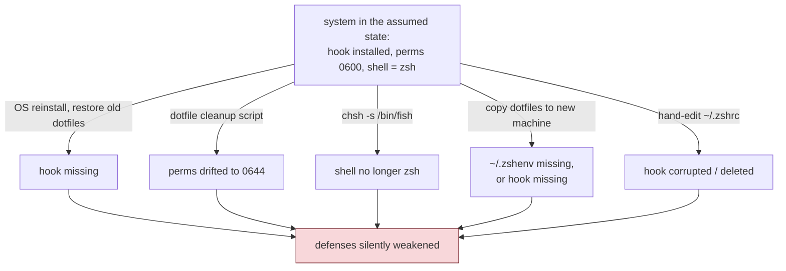
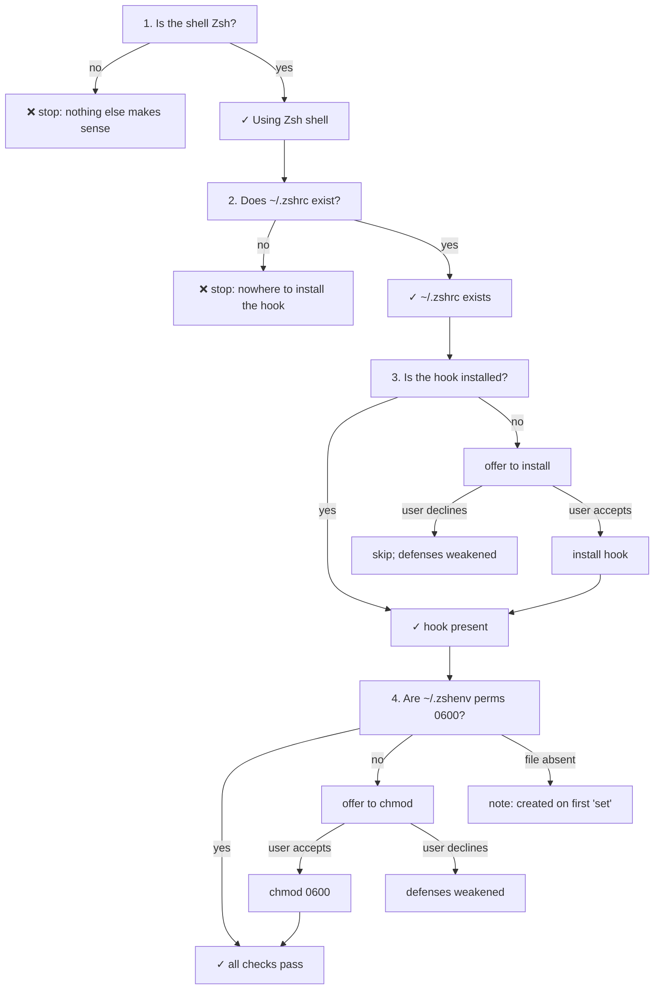
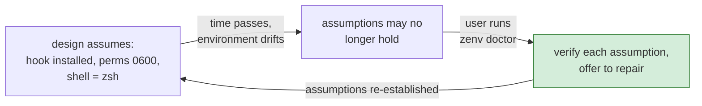
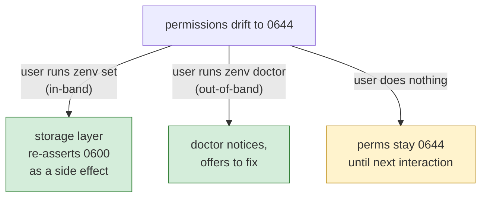

# Chapter 8 — Doctor, and the Honesty Loop

Verifies the hook is installed. Does not chmod `~/.zshenv`. May import leftover zenv export lines from that file into Keychain.

This makes `doctor` the most quietly subversive command in the tool. Every other chapter has argued, in one way or another, that zenv's defenses are coherent if their preconditions hold: the hook has to be installed, the permissions have to be `0600`, the shell has to be Zsh. `doctor` is the admission that those preconditions do not hold forever, and the machinery to put them back.

## Secrets rot

The state zenv depends on is not stable. It drifts, in well-understood ways, on a timescale of weeks.

The user reinstalls their operating system and restores their dotfiles from backup, but the backup is two weeks old and does not include the masking hook in `~/.zshrc`. The user copies their dotfiles to a new machine and forgets to copy `~/.zshenv` itself, so the secrets are gone. The user runs a "dotfiles cleanup" script that resets permissions on everything in their home directory, and `~/.zshenv` quietly becomes world-readable. The user switches their default shell from Zsh to Fish to try it out, and the hook stops working because Fish does not parse Zsh function syntax.



None of these are bugs in zenv. They are changes to the environment zenv runs in. And critically, *all of them weaken zenv's defenses silently*. A missing hook does not produce an error message; it produces an `env` command that happily prints secrets in cleartext, exactly as it would have before zenv was installed. The user has no indication that anything is wrong, because the failure mode of every zenv precondition is "zenv does not defend anything, and the shell behaves as if zenv were not there."

This is the deepest argument for a `doctor` command. A tool whose failure mode is silent degradation needs an active check, because the user cannot otherwise tell that the tool has stopped working. `doctor` is that check.

## The checks, as a state machine

`doctor` runs four checks in order, and the order is itself a piece of design. Each check is a precondition for the ones that follow.



The ordering reflects a dependency chain. If the shell is not Zsh, none of the other checks matter — the hook is Zsh-specific and will not work, so installing it would be theater. If `~/.zshrc` does not exist, there is nowhere to install the hook, so checking the hook is moot. If the hook is not installed, the permissions on `~/.zshenv` are irrelevant — the secrets will leak through `env` regardless of who can read the file at rest. The checks are sequenced so that each one tests a precondition for the value of the next.

This is worth pulling out as a principle. *Order checks by dependency, so that a failure early in the sequence makes the later checks moot.* The alternative — running all checks independently and reporting a wall of issues — gives the user a list that is hard to act on, because some of the issues are downstream of others. The sequenced version gives the user one thing to fix at a time, in an order where each fix unlocks the meaning of the next check.

## Confirm-before-mutate, again

`doctor` is read-mostly, but it can mutate: it installs the hook and fixes permissions. Both mutations go through a confirmation prompt, for the same reason migration does (Chapter 7). The user asked `doctor` to *check*; mutating without asking would violate the verb the user invoked.

```text
// Illustrative — doctor's confirm-before-mutate, in shape

status := hookIsPresent()
if status == missing {
    confirmed := confirmWithUser(
        "Install the display masking?",
        "This adds a script to your shell config that redacts secret values.",
    )
    if confirmed {
        installTheHook()
    }
}
// whether confirmed or not, continue to the next check
```

The confirmation text is worth noticing. It does not say "the hook is missing, install it?" — it says what the hook *does* and what installing it *will change*. A user who has forgotten what the hook is (or never knew) gets a one-sentence refresher in the prompt itself. The confirmation is documentation, briefly, at the moment it is relevant.

The discipline connects to a theme from Chapter 6: the tool prints the workaround for every constraint the user cannot see. Here, the constraint is "zenv can install the hook for you, and here is what that means." The user is not asked to remember; they are told, at the moment of asking.

## The honesty loop

Step back and `doctor` reveals a shape that recurs across well-designed tools: a closed loop between *assumed state* and *verified state*.

Every chapter of this book has rested on assumptions. Chapter 3 assumed the file is `0600`. Chapter 4 assumed the hook is installed. Chapter 1 assumed the shell is Zsh. These assumptions are reasonable at install time, when the user has just run `zenv doctor` and watched every check pass. They become unreasonable as time passes and the environment drifts. `doctor` is the mechanism that closes the loop — that lets the user re-verify, on demand, that the assumptions still hold.



The loop is the answer to a question that every long-lived tool has to face: *how does the user know the tool is still working?* For a tool whose failure mode is visible — a build system that prints errors when it breaks — the answer is "they will notice." For a tool whose failure mode is silent — a defense that quietly stops defending — the answer has to be an active check, available on demand, that re-asserts the preconditions.

This is why `doctor` is not a nice-to-have. It is the command that makes the rest of zenv's defenses *trustworthy over time*. Without it, the user would have to remember to manually inspect `~/.zshrc` for the hook markers and `stat` `~/.zshenv` for its permissions, on some schedule they would have to invent for themselves. They would not do it. The defenses would degrade, and the first sign of trouble would be a leaked secret on a screen share. `doctor` moves that sign of trouble from *after* the leak to *before* it.

## Idempotency as kindness

One more property of `doctor` is worth naming: it is idempotent. Running it on a healthy system produces a series of green checkmarks and exits without prompting. Running it again produces the same output. Running it after a drift produces a targeted set of prompts for exactly the things that drifted, and nothing else.

Idempotency is the property that makes `doctor` safe to run out of curiosity, or as part of a debugging ritual, or on a schedule. The user does not have to remember what state the system is in before running it; `doctor` will figure it out and act accordingly. A non-idempotent check — one that asks prompting questions even when nothing is wrong, or that re-runs setup steps that have already run — trains the user to avoid it, which defeats the purpose.

The same shape applies to any "verify and repair" command. It should be idempotent and default to the cheapest safe behavior (check only, prompt before mutating). The user should be able to run it reflexively, the way they might run `git status`, without worrying that running it will change anything. The change, when it comes, is gated behind an explicit confirmation.

## The relationship to the storage layer's in-band repair

There is a nice parallel between `doctor` and a detail from Chapter 3 that is worth making explicit. The storage layer re-asserts `0600` permissions on every write, so that a permissions drift is repaired the next time the user runs `zenv set`. That is *in-band* repair — it happens as a side effect of normal use. `doctor` is *out-of-band* repair — it happens when the user explicitly asks.



The two mechanisms are complementary, not redundant. In-band repair handles the drift the user does not notice, the next time they happen to use the tool. Out-of-band repair handles the drift the user *does* notice (or wants to rule out), on demand. Together they cover both cases: the passive case where the tool self-heals through normal use, and the active case where the user wants to confirm the system is healthy before a screen-share or a demo.

The takeaway is that *important invariants deserve both in-band and out-of-band enforcement*. In-band enforcement is cheap and continuous but only fires when the tool happens to be used. Out-of-band enforcement is on demand and comprehensive but requires the user to remember to invoke it. Neither is sufficient alone; together they cover the space.

## Apply This

1. **Build a `doctor` for any tool whose failure mode is silent.** If the tool's preconditions can drift without producing an error (permissions, installed hooks, environment variables, configuration files), the user cannot tell when the tool has stopped working. An active check command closes the loop between assumed state and verified state and turns silent degradation into a discoverable, repairable condition.
2. **Order checks by dependency, not by category.** When a sequence of checks has preconditions among them, run them in dependency order and stop (or de-prioritize) the downstream checks when an upstream one fails. A user can act on one fix at a time, in the order that makes each subsequent fix meaningful. A flat list of independent issues is harder to triage.
3. **Make verify-and-repair commands idempotent and default to check-only.** The user should be able to run the command reflexively, like `git status`, without worrying it will change anything. Mutation, when offered, is gated behind an explicit confirmation whose text explains what the mutation does. Idempotency is what makes the command safe to run out of curiosity or on a schedule.
4. **Enforce important invariants both in-band and out-of-band.** In-band enforcement (re-asserting on every write) is continuous but only fires when the tool is used. Out-of-band enforcement (a `doctor` command) is comprehensive but requires the user to invoke it. Important invariants deserve both, because they cover different drift scenarios.
5. **Use confirmation prompts as micro-documentation.** The prompt for a mutation should not just ask yes/no; it should briefly state what the mutation does, so a user who has forgotten (or never knew) gets a one-sentence refresher at the moment it is relevant. The prompt is the most-read documentation in the tool, because it appears exactly when the user is paying attention.
