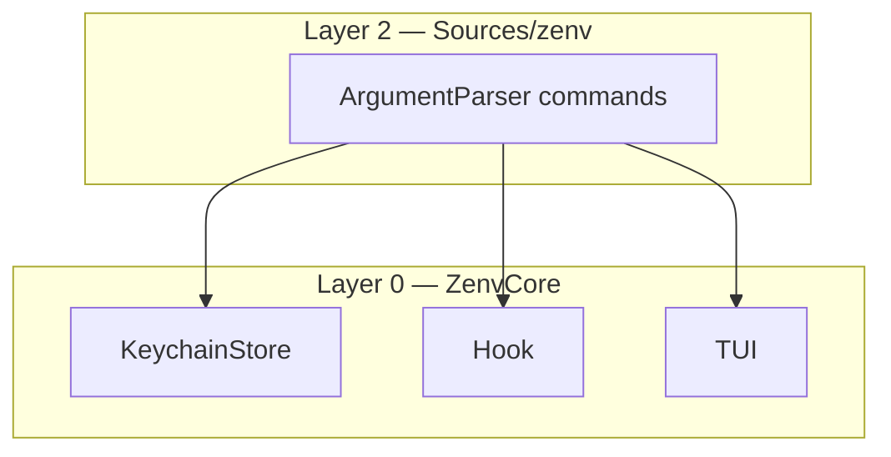
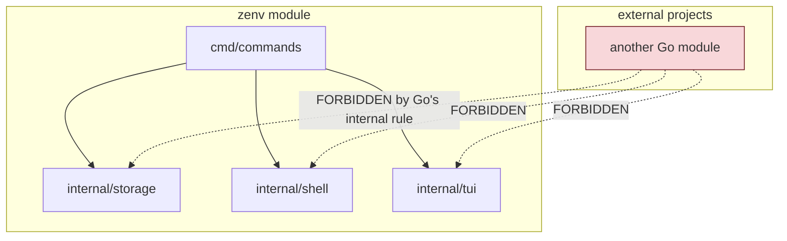
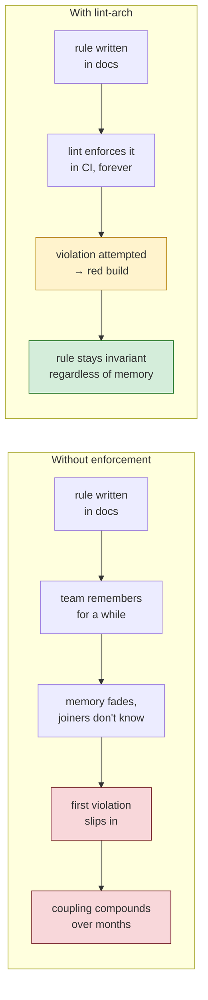

# Chapter 9 — Architecture as Invariant

Live code is Swift. `Sources/ZenvCore` must not import ArgumentParser. The Go `internal/` story below is historical.

Every previous chapter has treated the layering of zenv as a given. The storage layer does not know about the TUI; the TUI does not know about the shell; the command layer orchestrates all three. This chapter is about that layering itself — why it exists, why it matters at a scale where it would be easy to dismiss, and how it is enforced.

The argument of this chapter is unfashionable. zenv is small enough to read in an afternoon. Conventional engineering wisdom says that architecture at this scale is overkill — that a small team should be able to hold the whole program in its head and that layering rules are a tax paid by larger projects. The argument here is the opposite: that the discipline matters *especially* at small scale, because small scale is when the habits are set, and the habits survive the growth that the project hopes for.

## The four layers, restated

zenv is divided into four layers, ranked by what they may depend on.



| Layer | Package | May import |
|-------|---------|-----------|
| 2 | `Sources/zenv` | `ZenvCore`, ArgumentParser |
| 0 | `ZenvCore` | Foundation, Security, Darwin. No ArgumentParser |

The table is small enough to memorize, and that is the point. A contributor can keep the entire dependency contract in their head. The contract has two hard invariants: layer 0 imports nothing internal, and layer 1 never imports layer 2. Everything else follows from where each package sits.

The layering is not load-bearing in the technical sense — the program would compile and run if `internal/storage` imported `internal/tui`. It is load-bearing in the engineering sense: it is what keeps the program modifiable, testable, and honest about its boundaries.

## Why layer at this scale

The case against layering at small scale is straightforward. With a codebase this small, any engineer can read the whole thing in an afternoon. Naming conventions communicate intent. A cycle here or there is a local mess that gets cleaned up when it hurts. The overhead of formal rules and a lint pass to enforce them looks like ceremony for ceremony's sake.

The case for layering at small scale rests on three claims, each of which is worth examining.

**Layers are how a reader navigates a codebase they did not write.** A new contributor opening zenv for the first time does not know what depends on what. The layer table tells them, in fifteen seconds: if you want to understand storage, look at `ZenvCore`; storage cannot reach up into the CLI, so you will not be surprised by a call from `KeychainStore` into ArgumentParser. Without the table, the contributor has to grep their way to the same understanding, and they will get it wrong a few times first. The layer table is a map; the map is cheap to draw at small scale and expensive to reconstruct at large scale.

**Layers are what make changes local.** When a change is local to one layer, the blast radius of review is bounded. A change to the storage layer's atomic write (Chapter 3) can be reviewed against the storage layer's contract, without considering whether it breaks the TUI — because the storage layer cannot depend on the TUI, so it cannot break it. Without the layering, every change is potentially a cross-cutting change, and every review has to consider the whole program. The layering converts "this might affect anything" into "this affects at most this layer and the ones above it," which is a different and more tractable kind of review.

**Layers are what survive growth.** zenv is small today. If it succeeds, it will not stay small. Features accrete: support for another shell, a sync feature, a rotation reminder, a UI for editing values. Each feature is a chance to introduce a dependency the layering forbids, and each such dependency is a piece of coupling that has to be lived with forever. The discipline of refusing those dependencies at small scale is what makes the codebase modifiable at large scale. By the time the project is large, the habits are set, the lint pass is in CI, and the rules enforce themselves.

The third claim is the most important and the most contested. It says that *the value of architectural discipline is paid forward*. The cost is paid now, by the small team that has to respect rules it could safely bend. The benefit is paid later, by the larger team that inherits a codebase whose boundaries held. The asymmetry is uncomfortable but correct: the team that bends the rules at small scale is rarely the team that pays for the bending, because by the time the bending hurts, the benders have moved on.

## What `internal/` does and does not buy

Go's `internal/` directory convention is part of the story here, and worth being precise about. A package under `internal/` can only be imported by packages within the directory subtree rooted at the parent of `internal/`. For zenv, that means `internal/storage`, `internal/shell`, and `internal/tui` can only be imported by code within the zenv module itself. External projects cannot reach in and depend on them.



What `internal/` does is prevent *external* coupling. A downstream tool cannot depend on zenv's storage layer's internals, which means zenv can refactor that layer freely without breaking anyone outside the module. This is genuinely valuable and is the right default for any package that is not deliberately a public library.

What `internal/` does *not* do is prevent *internal* coupling. Nothing in the Go language stops `internal/storage` from importing `internal/tui`. The language gives you a wall facing outward; it does not give you walls between the rooms inside the house. Those internal walls have to be built and maintained by the project itself, through convention and, in zenv's case, through a lint pass.

This distinction is worth pulling out because it is often conflated. Teams sometimes believe that putting packages under `internal/` is sufficient architectural discipline, on the grounds that "at least the outside world cannot depend on our internals." It is sufficient discipline against the outside world. It is no discipline at all against the inside, which is where most of the damaging coupling happens. The internal walls — the ones between `storage`, `shell`, `tui`, and `commands` — are the ones that have to be enforced by something other than the language.

## Enforcement: the lint pass that does the work

zenv enforces its layering with `make lint-arch`. The pass fails if `ZenvCore` imports ArgumentParser.

```mermaid
flowchart TD
    Dev["developer writes code"]
    Dev --> Commit["commit"]
    Commit --> CI["CI runs make lint-all"]
    CI --> Arch["lint-arch: parse import graph"]
    Arch --> Check{"any layer<br/>violation?"}
    Check -->|no| Pass["✓ CI passes"]
    Check -->|yes, e.g. storage → tui"| Fail["❌ CI fails,<br/>names the offending import"]
    Fail --> Dev
    style Fail fill:#f8d7da,stroke:#721c24
    style Pass fill:#d4edda,stroke:#2e7d32
```

The pass is small, because the contract is small. It is essentially a whitelist of allowed import directions, checked against the actual import graph after compilation. There is no static analysis wizardry; the rule is "package X may not import package Y," applied four times.

What makes this worth doing is the *shift* it produces in the development workflow. Without the lint pass, a layering violation is a code-review discussion. The reviewer has to notice the import, recall the rule, push back, and follow up on the revision. This is review-time work, done by humans, fallibly, under deadline pressure. Violations slip through, especially when the reviewer is tired or the change looks small.

With the lint pass, the same violation is a CI failure. The developer who adds the forbidden import gets a red build, with a message naming the offending import, before the change reaches a human reviewer. The discussion that would have happened in code review — "you cannot import the TUI from storage" — never happens, because the lint pass already had it. The reviewer's attention is freed for the parts of the change that require judgment, which is what review is for.

The takeaway is that *rules without enforcement are documentation; rules with enforcement are architecture*. A layering rule expressed only in a wiki page will be violated under pressure, because the pressure is real and the wiki page is not in the build. The same rule expressed as a CI failure cannot be violated without an explicit decision to bypass the lint, which is a different and more deliberate act than "I forgot." The enforcement is what turns the rule from aspiration to invariant.

## Why the invariants matter even when nothing breaks

A skeptic will point out that zenv works fine today, with no layering violations, and that the lint pass has never caught anything because the team has never tried to violate the layering. By that logic, the lint pass is overhead with no demonstrated return. This is the same argument as "why wear a seatbelt, I have never been in a crash," and it has the same answer.

The lint pass has not caught anything *yet* because the codebase is young and the contributors are the people who wrote the rules. The return comes later, when a contributor who did not write the rules — or a future version of the original contributor who has forgotten them — adds a dependency that feels reasonable in the moment and is not. The lint pass is the thing that turns that moment from "a quiet step toward an unmodifiable codebase" into "a red build and a conversation."



The shape is real, even if the timeline is illustrative. An invariant without enforcement decays on a timescale of months, as memories fade and team composition changes. An invariant with enforcement does not decay, because the enforcement does not depend on memory. The cost of the enforcement — one small lint pass, a few seconds per CI run — is paid continuously. The cost of no enforcement is paid all at once, the day the team realizes the codebase has become hard to change and decides whether to invest in untangling it.

## The same move, across the book

The layering rule is one example of a broader pattern: *encode the rules that matter as invariants the build enforces*. zenv has several others, scattered across the chapters of this book.

The storage layer's atomic write is an encoded rule: "secrets file writes must be crash-safe." Chapter 3.

The masking hook's no-op fallback is an encoded rule: "the failure mode of the defense is the safe one." Chapter 4.

The silent-cancel convention is an encoded rule: "user cancellation returns nil." Chapter 6.

The denylist in migration is an encoded rule: "do not migrate path-like variables." Chapter 7.

Each of these could have been a wiki page. Each of them, as a wiki page, would have been violated under pressure. Each of them, encoded in code, becomes a property the system has by construction rather than by intention. The layering lint is the same pattern applied to the architecture itself: the rule is the import graph, the enforcement is the CI pass, and the invariant is the result.

The deepest lesson of this chapter, and maybe of the book, is that *the architecture is what the build enforces*. Everything else is a wish. A small team that internalizes this habit — encode the rules that matter, enforce them in CI, accept the small ongoing cost — ships codebases that stay modifiable as they grow. A small team that does not ships codebases that work fine for a year and then, suddenly and seemingly mysteriously, become hard to change.

## Apply This

1. **Layer even at small scale, because the habits outlast the size.** The cost is paid now by the team that could safely bend the rules; the benefit is paid later by the team that inherits a codebase whose boundaries held (see above). Internalize the discipline before growth forces it; growth rarely improves discipline.
2. **`internal/` is an outward-facing wall, not an inward-facing one.** Go's `internal/` convention prevents external coupling, which is valuable. It does nothing to prevent internal coupling, which is where most damaging dependencies live. Plan separately for the internal walls.
3. **Encode the rules that matter as invariants the build enforces.** A rule in documentation decays on a timescale of months, as memory and team composition change. The same rule as a CI failure does not decay, because enforcement does not depend on memory. Rules without enforcement are documentation; rules with enforcement are architecture.
4. **Make the lint pass small and the contract small enough to memorize.** zenv's layering rule is four lines in a table. A contributor can hold the whole contract in their head. A large, complex architectural rule will not be respected because it will not be remembered; a small one will, especially when it is enforced.
5. **Free human review for the parts that need judgment.** Mechanical rules — import directions, formatting, naming — belong in CI, so that human review is spent on the parts of a change that require judgment. The lint pass that enforces layering is not replacing review; it is removing from review the part review is worst at, which is noticing imports under deadline pressure.
